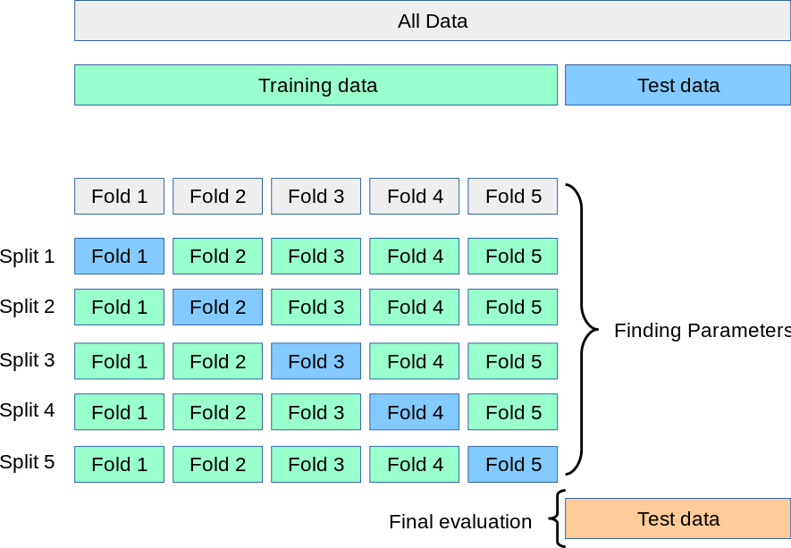
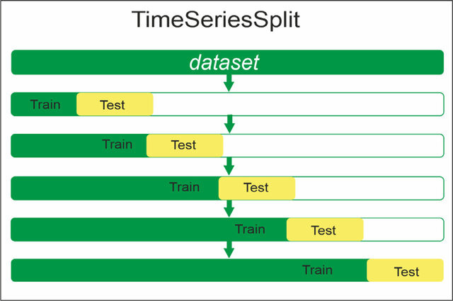
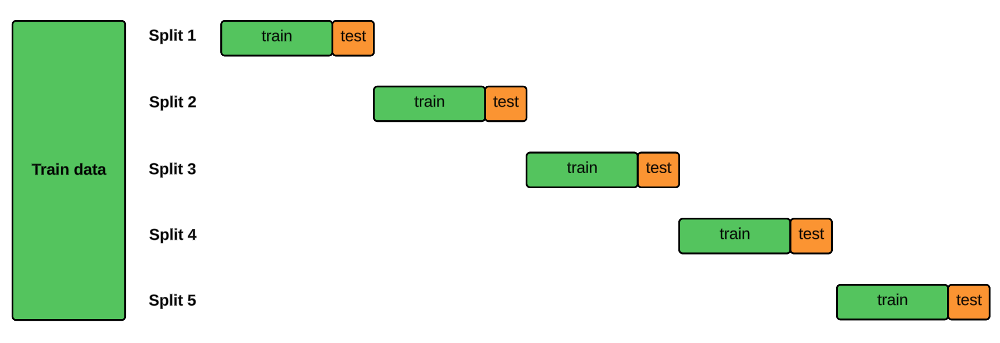
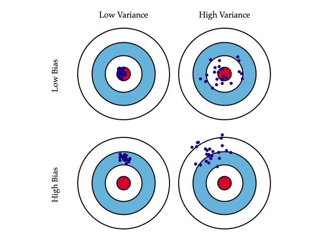
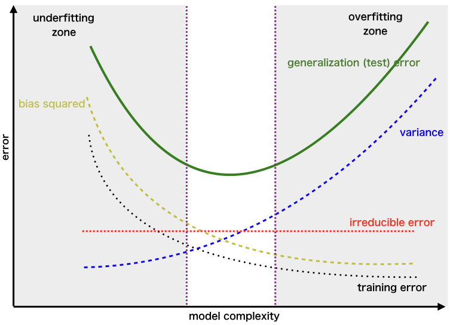

<!-- paginate: skip -->

<h1 class="section-header">Лекція 10</h1>

## Перехресна валідація, регуляризація, боротьба з пере- та недонавчанням.

---

# Проблема узагальнення

<!-- paginate: true -->

У машинному навчанні ми хочемо знайти функцію:
$$
\hat{f}(x) \approx y,
$$
яка добре передбачає *не тільки на тих даних, на яких навчалась*, а й на нових.
Тоді говоримо, що модель *узагальнює*, тобто мінімізує очікувану помилку:
$$
R(f) = \mathbb{E}_{x,y \sim P(x,y)}[L(y, f(x))],
$$
яка невідома, тому вимірюємо лише *емпіричний ризик* (на train):
$$
R_{emp}(f) = \frac{1}{n}\sum_{i=1}^{n} L(y_i, f(x_i)).
$$

---

# Проблема узагальнення

Найкраще щоб $R_{emp}$ був малим і $R$ також малим. У практиці ж трапляється два проблемні стани:

| | | |
|---|---|---|
| Перенавчання | $R_{emp} \ll R$ | Модель памʼятає, а не вчиться |
| Недонавчання | $R_{emp} \approx R$ обидва великі | Модель слабка і не уловлює структуру |

Надалі ми розглянемо як досягти контролю над цими двома крайностями.

---

# Проблема узагальнення

**Практичний приклад:**  
Модель навчали прогнозувати вартість нерухомості у місті $M$. На train $MAE = 18 000$грн, але на нових районах ціна помиляється вже на $55 000$грн. 
Це означає, що модель вивчила ціни лише у знайомих районах і не може узагальнити інформацію — низький $R_{emp}$, але високий $R(f)$, тобто тут є очевидним наявність перенавчання.

---

# Перехресна валідація

Для фіксованого розбиття $D = D_{train} \cup D_{test}$, модель оптимізує $R_{emp}$ на train, але test — лише *одна випадкова оцінка*.
- Якщо train і test випадково схожі, то оцінка оптимістична.
- Якщо test містить іншу структуру, то оцінка песимістична.

Для гарантування коректості моделі потрібна стійка оцінка:
$$
\widehat{R} = \mathbb{E}*{split}(R*{test}),
$$
яку можна наближити за рахунок перехресної валідації.

---

# Перехресна валідація

Перехресна валідація це не про генерацію багатьох метрик, а про перевірку стабільності.

Наприклад при розбитті Airbnb-даних $80/20$ $MAE = 20\$$, але при іншому розбитті $MAE = 54\$$.
Це означає, що модель якісна лише на "підхожому" поділі. І, наприклад, тільки після 5-fold перехресній валідаці середній MAE стабілізується — $36\$$.

---

# k-fold перехресна валідація

Дані діляться на $K$ блоків $D_1,\dots, D_K$.
Для кожного $i$:

$$
f_i = Train(D \setminus D_i), \quad score_i = Test(f_i, D_i)
$$
Середня помилка:
$$
CV_K = \frac{1}{K}\sum_{i=1}^K score_i,\quad
Var(CV_K) = \frac{1}{K}\sum(score_i - CV_K)^2
$$

Тепер модель оцінена $K$ разів на різних тестах, тому результат набагато ближчий до реального ризику $R(f)$.

---

---

# k-fold перехресна валідація

Наприклад ми беремо $K=5$, тобто дані про енергоспоживання діляться на 5 частин: чотири частини йдуть на навчання, одна — на перевірку. Процес повторюється 5 разів, і модель отримує 5 різних перевірок.

**Можливий результат:**  
$$
Fold_1 = 0.92, Fold_2 = 0.89, Fold_3 = 0.91, Fold_4 = 0.90, Fold_5 = 0.93
$$
$$
CV \approx 0.91
$$
модель поводиться узгоджено, коливання невеликі. Отже, модель стабільна.

---

# Bias–Variance декомпозиція

Перехресна валідація повʼязана з фундаментальним розкладом очікуваної помилки:

$$
\mathbb{E}[(y-\hat{f}(x))^2] = \underbrace{Bias^2}_{недонавчання}
* \underbrace{Variance}_{перенавчання}
* \underbrace{Noise}_{нередукований шум}
$$

- високий $Bias$: модель занадто проста, не вловлює закономірності
- висока $Variance$: модель занадто складна, чутлива до шуму

CV дозволяє виміряти $Variance$ у реальному середовищі.

---

# Bias–Variance декомпозиція

Якщо ми тренуємо дуже просту лінійну модель на складних даних, вона не бачить нелінійності, отже $Bias$ високий.  
А якщо беремо модель із XGBoost 1000 дерев і без регуляризації то модель вивчить усе включно з шумом - $Variance$ високий.

**Результат експерименту:**
- лінійна модель: Train=58%, Test=59% - недонавчання
- складний ансамбль: Train=99%, Test=71% - перенавчання
- оптимальний ансамбль з регуляризацією: Train=91%, Test=86%

---

# Перехресна валідація на часозалежних даних

Для часових даних стандартний $k-fold$ не є застосовним, оскільки створює витік даних (data leakage) (майбутнє впливає на минуле).
Тому CV на часозалежних даних виконує TimeSeriesSplit:
$$
Train_1 \rightarrow Test_1,\quad
Train_1+Train_2 \rightarrow Test_2,\quad
\ldots
$$
Оцінка:
$$
CV_{\text{ts}} = \frac{1}{K}\sum_{i=1}^K score(f_i, Test_i)
$$
Це є коректна схема, коли $x(t)$ залежить від часу.

<!-- https://towardsdatascience.com/reduce-bias-in-time-series-cross-validation-with-blocked-split-4ecbfc88f5a4/ -->

---

---

---

# Перехресна валідація на часозалежних даних

При прогнозі енергоспоживання не можна перемішувати різні сезони як-от зиму та літо: зимові піки не мають потрапляти у тренування на літо.  
TimeSeriesSplit моделює прогноз на майбутнє поступово:
$$
Train=2015 \rightarrow Test=2016
$$
$$
Train=2015-2016 \rightarrow Test=2017  
$$
$$
Train=2015-2017 \rightarrow Test=2018 \dots
$$
Якщо модель провалюється на тестових даних 2018 року, це не є статистичною помилкою, а вказує на те, що модель не змогла адекватно узагальнити дані і зробити точний прогноз.

---

# Регуляризація для контролю складності моделі

Ми не просто мінімізуємо втрату $L$, а ще й додаємо штраф за складність.
У загальній формі:
$$
J(w) = L(w) + \lambda \Omega(w)
$$

$\lambda$ — сила регуляризації,
$\Omega$ — норма параметрів.

---

# Ridge (L2)

$$
\Omega(w)=\sum w_j^2 \Rightarrow
J(w)=\sum (y_i-\hat{y_i})^2+\lambda \sum w_j^2
$$

Геометрична інтерпретація:
- обмеження параметрів: багатовимірна сфера
- великі ваги *згладжуються*, але не стають нулями
- зменшує $Variance$, трохи збільшує $Bias$

---

# Ridge (L2)

Під час прогнозування цін квартир модель дає надто високі коефіцієнти при рідкісних ознаках, наприклад `distance_to_river`. Вона вловила шум, а не закономірність.

Після додавання L2:
$$
J(\beta) = \sum(y-\hat{y})^2 + \lambda \sum \beta_j^2,  
$$
ваги стабілізуються, коефіцієнти стають плавнішими, а тестова помилка падає з 95 000 грн до 41 000 грн.

---

# Lasso (L1)

$$
\Omega(w)=\sum|w_j|
$$
Ось аналогічний стислий підсумок для **L1 — Lasso**:

Геометрична інтерпретація:
- обмеження параметрів: багатовимірний ромбоїд
- стимулює розрідженість моделі: ваги стають $=0$
- сильно зменшує *Variance*, може суттєво збільшувати *Bias*
- виконує відбір ознак (feature selection)
  $$
  \exists j: w_j = 0
  $$

---

# Lasso (L1)

Дані по Airbnb мають 240 ознак після feature engineering. Частина з них дублює інформацію або майже не впливає на ціну (наприклад, `tv_brand` чи `curtains_color`). Lasso прибирає їх:
$$  
\beta_j = 0 \quad\text{для малозначущих ознак}.  
$$
Отримуємо лише суттєві фактори. Як наслідок модель простіша.

---

# ElasticNet (комбінований випадок)

Коли ознак багато й вони корельовані (рейтинг району, відстань до метро, середній дохід району), Lasso може вибрати одну випадкову, відкидаючи інші. ElasticNet зберігає стійкість і зменшує хаос:

$$  
L = RSS + \lambda(\alpha ||w||_1 + (1-\alpha)||w||_2^2)  
$$

Практично лишається не одна ознака, а три, тому модель не "провалюється" при випадкових змінах вхідних даних.

---

<!--

---

# Регуляризація та опуклої оптимізація

* Ridge розвʼязується аналітично через градієнт:
  $$
  \beta = (X^TX + \lambda I)^{-1}X^Ty
  $$
* Lasso → задача розв’язується LARS/Coordinate Descent, бо норма не диференційована в 0
* ElasticNet → комбінація двох просторів, контроль sparsity параметром α

---
--->

# Перенавчання

$$
R_{emp} \to 0,\quad R(f) \to \text{ велике}
$$
Тобто модель надмірно усуває шум з даних.
Наприклад у випадку дерева рішень це виглядає як
- глибоке дерево до досягнення листків=1
- У SVM — надто малий $C$, вузький margin
- у нейромережах надмірно багато шарів.

Ознаки:
- різниця між train і CV велика
- модель реагує на дрібні зміни вибірки
- важливість ознак хаотична

---

# Перенавчання

Модель для прогнозу затримок рейсів вивчила конкретні маршрути та дати з історії, тому на Train показує 95% точності.  
Але новий рейс з дещо іншим маршрутом — і точність падає до 64%.
Тобто модель вміє "згадати" старі дані, але не "розуміє" нових даних і погано їх узагальнює.

---

# Недонавчання

Формально недонавчання можна означити як:
$$
R_{emp} \approx R(f) \approx велике
$$

Модель пропускає закономірності — у неї високий bias.

Причини:
- лінійна модель на нелінійних даних
- недостатня кількість ознак
- надмірна регуляризація

---

# Недонавчання

Застосовано просту лінійну модель до Chicago Crime даних, які мають нелінійні сезонні патерни, свята, погодні зміни. Train Accuracy = 52%, Test = 50%.  
Коли, наприклад, додаємо RandomForest і нові ознаки (сезонність, тиждень року, погода), точність піднімається до 80%.

---

# Bias–Variance компроміс 

<!-- Компроміс зсуву та дисперсії (Bias–variance tradeoff) -->

Компроміс зсуву та дисперсії описує фундаментальний баланс між двома джерелами помилок у моделях машинного навчання: упередження/зміщенням (bias) та дисперсія/варіативністю (variance).

Так як характеристики bias та variance знаходяться в певній залежності: зменшення одного часто збільшує інше. Наприклад,
- збільшення складності моделі зменшує bias, але підвищує variance; 
- регуляризація (L1, L2) робить навпаки.

Мета навчання полягає в тому, щоби знайти оптимальний баланс. Тобто таку складність або таку регуляризацію, при яких $Bias^2 + Variance$ мінімізує загальну помилку моделі. Саме цей компроміс визначає здатність моделі добре узагальнювати на нових даних.

---

---

