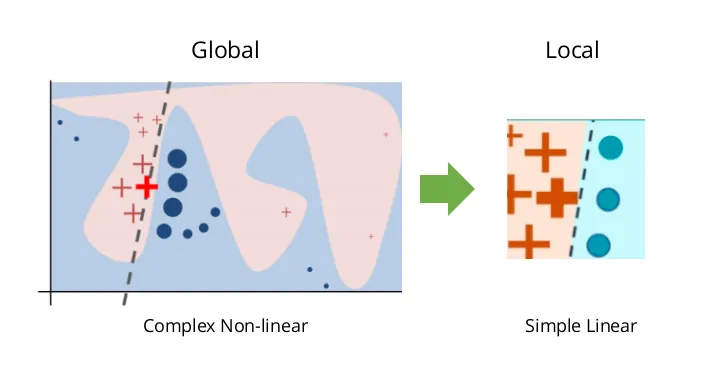
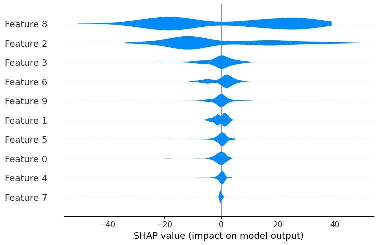
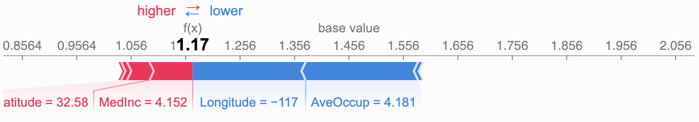
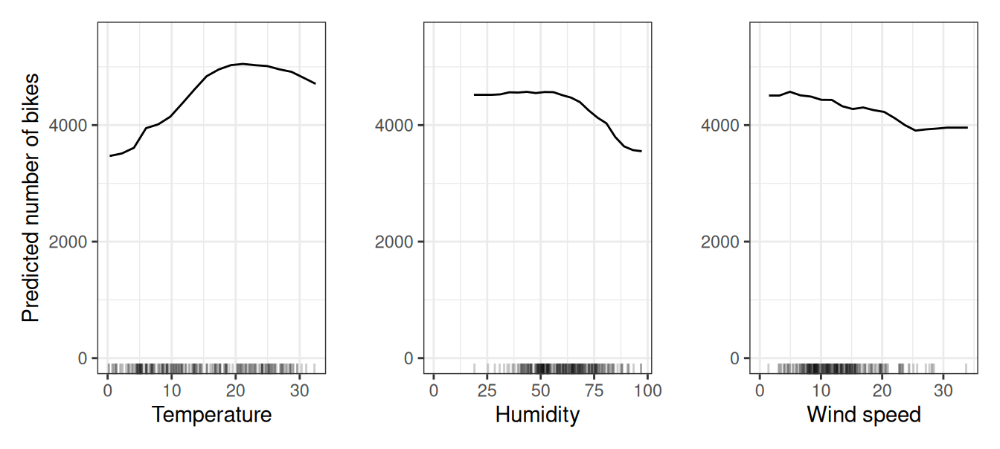
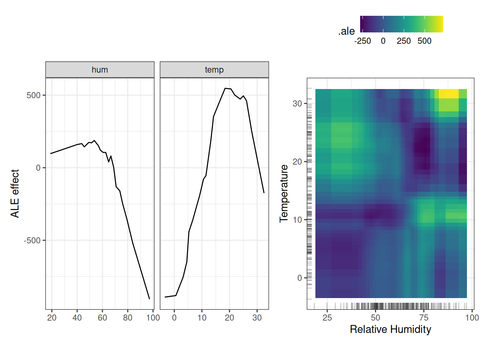

<!-- paginate: skip -->

<h1 class="section-header">Лекція 11</h1>

## Поясненний штучний інтелект (Explainable AI). SHAP і LIME

---

<!-- paginate: true -->

# Пяснюваність у сучасному ML

У міру того, як машинне навчання поширюється у критично важливих сферах, просте передбачення часто не є достатнім.

Рішення моделі впливають не на абстрактні вибірки, а на реальних людей - пацієнтів, позичальників, водіїв, вкладників, орендодавців і пасажирів.

У таких ситуаціях недостатньо сказати: "модель передбачила результат із точністю 93%". Треба зрозуміти, чому саме вона дійшла такого висновку.

---

Пояснюваність є ключовим компонентом довіри, безпеки та юридичної відповідальності.
- Якщо модель відмовляє у кредиті, то регулятор країни може вимагати повного пояснення причин.
- Якщо медична модель пропонує перевірити пацієнта на окреме захворювання, лікар повинен знати обґрунтування: які симптоми чи показники аналізів є критичними.
- Якщо модель прогнозує відмову обладнання у промисловості, інженер повинен розуміти, що є причною: вібрації, температура, знос і т.д..

Тому точність не є єдиною ключовою вимогою, такими зокрема є прозорість та контрольованість. Для досягення цих кретеріїв використовують методи поясненого ШІ як-от SHAP і LIME.

---

# Глобальна та локальна інтерпретація

У поясненості важливо розділяти два запитання:
1. Що загалом впливає на рішення моделі?
2. Що вплинуло на конкретне рішення для конкретної точки?

Це два рівні інтерпретації: глобальний і локальний.

**Глобальна інтерпретація** дозволяє зрозуміти весь механізм моделі. Вона відповідає на питання: "які ознаки найважливіші загалом?" або "як середній вплив ознаки змінює результат?".
Наприклад, у моделі для ціни Airbnb глобальні методи одразу покажуть, що розташування має більший вплив, ніж кількість спалень, і що "room_type" є сильним фактором підвищення вартості. Це розуміння допомагає бізнесу формувати цінову політику чи визначати ключові компоненти сервісу.

---

# Глобальна та локальна інтерпретація

**Локальна інтерпретація** зосереджується не на середньому випадку, а на конкретній ситуації. Вона відповідає на питання: "чому модель прийняла рішення для саме цієї квартири Airbnb?".
Для прикладу, дві квартири можуть мати однакове розташування та однакову кількість кімнат, але різні оцінки.
Локальна інтерпретація покаже, що у першої дуже багато відгуків з високим рейтингом, а у другої нестандартна політика скасування або занадто багато інших оголошень від цього ж хоста.

Тобто, глобальні моделі дають загальну картину, а локальні дозволяють пояснити індивідуальні рішення.
SHAP поєднує обидва рівні, тоді як LIME зосереджується лише на локальному.

---

# SHAP: внесок Шеплі

SHAP (SHapley Additive exPlanations) базується на строго математичній конструкції – значеннях Шеплі з теорії кооперативних ігор. У класичній задачі гравці утворюють коаліції, і потрібно визначити внесок кожного гравця в загальний результат.
Якщо перенести це як аналогію на машинне навчання, кожну ознаку можна вважати гравцем, а передбачення моделі — виграшем.

Ціль — визначити середній внесок кожної ознаки у передбачення моделі.
Формально, значення Шеплі для ознаки $i$ визначено як:

$$
\phi_i = \sum_{S \subseteq N \setminus {i}}
\frac{|S|! (|N|-|S|-1)!}{|N|!}
\big( v(S \cup {i}) - v(S) \big)
$$

де $S$ — коаліція ознак, а $v(S)$ — значення моделі, коли враховуються тільки ознаки з цього набору.

---

# SHAP: внесок Шеплі

Формула означає, що беруться всі можливі підмножини ознак і обчислюється, наскільки "додаткова поява" ознаки $i$ підвищує точність чи змінює прогноз.
Потім усереднюють внесок по всіх можливих коаліціях.

На практиці перебір усіх коаліцій неможливий (їх $2^p$). Але SHAP забезпечує ефективні алгоритми для дерев (TreeSHAP), а KernelSHAP дає метод наближення для будь-якої моделі.

SHAP має такі властивості: справедливість, симетрію, адитивність і локальну точність.

---

# SHAP: приклад Airbnb

<!-- https://www.aidancooper.co.uk/a-non-technical-guide-to-interpreting-shap-analyses/ -->

Нехай, XGBoost прогнозує ціну Airbnb. Середня базова ціна моделі ~ 120$.
Це те, що модель передбачила б, якщо, наприклад, усереднити по всьому набору.

Тепер для конкретної квартири SHAP обчислює внесок кожної ознаки. Наприклад:
- "розміщення у центрі" дає +65$
- "кількість ванних кімнат" дає +22$
- "кількість інших об’яв у цього орендодавця" дає –18$

Тоді модель пояснюється просто:
$$
120 + 65 + 22 - 18 = 189$
$$

SHAP не просто показує що важливо у середньому, а точково пояснює, як ознаки змінюють прогноз у конкретній ситуації.

---

# SHAP: приклад кредитування

Нехай, що банк прогнозує ймовірність дефолту. Модель відмовляє клієнту у кредиті. SHAP показує, що:
- висока кредитна заборгованість зменшує прогнозовану "ймовірність погашення" на -0.23,
- декілька попередніх прострочених платежів зменшують ще на -0.17,
- високий дохід збільшує на +0.12,
- стабільність роботи за останні 5 років дає +0.04.

Отже, рішення не тільки зрозуміле, а й обґрунтоване. SHAP дозволяє побачити, що ключовими факторами відмови стали прострочки та заборгованість — а не дохід, який, навпаки, зіграв на користь клієнта.

---

# LIME

LIME (Local Interpretable Model-agnostic Explanations) підходить до пояснення іншим шляхом. Тут припускається, що будь-яку складну модель можна наблизити лінійною моделлю, але лише *в околі* конкретної точки.

Це означає, що модель не потрібно пояснювати всюди, достатньо з’ясувати, як вона змінюється при невеликих варіаціях ознак.

---

# LIME

- Обирається точка $x_0$, яка нас цікавить. 
- Далі генерується велику кількість варіацій цієї точки і трохи змінює значення ознак і дивиться, як змінюється передбачення моделі.
- Для цих точок модель є чорною скринькою і просто запитується прогноз моделі.
- Після цього навчається лінійна модель, що апроксимує поведінку чорної скриньки у цьому локальному просторі.
- У результаті отримується набір ваг лінійної моделі, які можна легко прочитати. Вони вказують, наскільки локальні зміни ознаки змінюють передбачення.

---

---

# LIME: приклад Airbnb

Припустімо, що складна модель (наприклад, CatBoost) передбачає ціну для конкретної квартири Airbnb (лише якоїсь конкретної, а не загалом).

LIME використовує ознаки такі моделі: тип житла, кількість спалень, кількість відгуків, відстань до центру, рейтинг орендодавця тощо.
Далі створюються нові "схожі" точки/квартири трохи дорожчі або дешевші, трохи більші або менші, з трохи іншими відгуками. Для кожної точки запитується ціна у моделі і далі навчається локальна лінійна модель.

---

# LIME: приклад Airbnb

LIME може показати, що у цієї квартири:
- тип житла додає +60$,
- менше ніж 1 км до центру додає +45$,
- велика кількість відгуків трохи зменшує ціну — можливо, квартири з великою кількістю відгуків дешевші (наприклад це старі оголошення).

---

# Порівняння SHAP і LIME

SHAP пояснення стабільні та відтворювані при повторних запусках. Він також дозволяє зробити глобальні висновки, що важливо для аналітики та побудови бізнес-стратегій.

LIME швидший і простіший для розуміння, але залежить від способу генерації сусідніх точок, і різні запуски можуть давати різні інтерпретації. Він підходить для пояснення окремих зразків у режимі реального часу, наприклад у банківському додатку або сервісі медичного прогнозування.

---

# Інтерпретація графіків SHAP

<!-- https://shap.readthedocs.io/en/latest/example_notebooks/api_examples/plots/bar.html -->

SHAP пропонує багатий спектр графічних засобів.
Найпоширенішим глобальним графіком є summary plot, який показує розподіл внесків SHAP для кожної ознаки. Значення вздовж осі X відображають силу впливу ознаки; колір показує конкретне значення цієї ознаки. Це дозволяє відразу побачити важливі закономірності. Наприклад, високі значення локаційного рейтингу збільшують ціну, а велика кількість оголошень її зменшує.

Локальні графіки, наприклад force plot, візуалізують суму внесків SHAP для конкретного передбачення. Отримується розклад прогнозу на окремі компоненти. Це зручний інструмент для пояснення кожного індивідуального рішення.

---

---

---

# Витік ознак (Data leakage)

Витік ознак — це ситуація, коли модель отримує інформацію, яку в *реальних умовах вона отримати не може*, або коли у тренувальних даних присутні *ознаки, що містять прямі чи непрямі підказки*, які штучно підвищують точність.

Іншими словами, модель навчається прогнозувати не на основі закономірностей, а на основі певного роду "підглядання" у майбутнє або у інформацію, яка не буде доступна при реальному використанні.

Методи поясненного ШІ добре виявляють витік ознак, оскільки SHAP або LIME показують, що певна ознака має аномально великий вплив, хоча вона не повинна.

---

# Прямий витік

Прямий витік відбувається коли колонка містить інформацію, яка напряму визначає цільову змінну. Наприклад:
- У задачі прогнозування ціни Airbnb в наборі даних збереглася колонка `ціна` після перетворення, або похідна від неї, наприклад `ціна за кімнату`.
- У кредитному рейтингу модель бачить колонку `дефолт минулого місяця`, хоча прогнозується дефолт наступного місяця.
- У медичних даних зустрічається колонка `остаточний діагноз`, хоча й ми повинні прогнозувати саме цей діагноз.

У згадани випадках SHAP показує, що ознака має надмірний позитивний/негативний внесок, внесок ознаки різко домінує над іншими, модель не може працювати без цієї ознаки.

---

# Непрямий витік

Це дещо складніший випалок, який вказує на ознаки, що не містить прямої інформації про цільову змінну, але приховано її кодуть/визначають. Наприклад:
- У наборі про польоти, припусто, стовпець `прибуття за розкладом` приховано містить інформацію про затримку, бо якщо літак запізнився, цей стовпець іноді свідомо перевизначають або ненавмисно "зсувають" через погану обробку даних.
- У задачах Airbnb стовпець `останній відгук` може відображати періодичність бронювання, що може виражатся як функція ціни.
- У медичних наборах `тривалість госпіталізації` зазвичай пов'язана з тяжкістю хвороби, а нам потрібно прогнозувати саме її.

Непрямий витік складно виявити простими методами, але SHAP може виділити ознаки з підозріло високим впливом, які не повинні грати такої ролі.

---

# Часовий витік

Виникає, коли модель бачить ознаки, які в реальному часі з’являться лише у майбутньому. Наприклад:
- У прогнозуванні обслуговування обладнання моделі бачить "максимальну температуру за останні 24 години", хоча прогноз потрібно робити *до* настання цих 24 годин.
- У маркетингових даних модель бачить майбутні покупки (наприклад при поділі даних на train/test/validation).
- У кредитних даних модель бачить інформацію, яка з’явилася після ухвалення рішення.

SHAP виявляє темпоральний витік за рахунок того, що ознака, яку не можна знати наперед, раптом стає надмірною за значущістю.

---

# Приклад витоку у моделі для Airbnb

Припустимо, модель прогнозує ціну оренди. SHAP показує:
- Найважливіша ознака — `час відгуку орендодавця`.
- Друга за важливістю — `останній відгук`.
- Третя — `доступність 365`.
Проблема може полягати в тому, що ці колонки *після публікації оголошення* залежатимуть від попиту та ціни, але *не можуть бути відомі на момент публікації* (на коли ми хочемо робити прогноз). Таким чином, модель "бачить у майбутнє".

SHAP повинен виявити таку проблему, а без SHAP модель працюватиме вкрай точно, але на реальних даних зазвичай працюватиме некоректно.

---

# Partial Dependence Plot

<!-- 
- https://christophm.github.io/interpretable-ml-book/
- https://christophm.github.io/interpretable-ml-book/pdp.
html
-->

Нехай модель позначимо як $f(x)$, а $x = (x_S, x_C)$, де $x_S$ — ознака (або група ознак), яку ми досліджуємо, а $x_C$ — решта змінних. Тоді часткова залежність визначається як математичне очікування:
$$
PD_S(s) = \mathbb{E}_{x_C}[f(s, x_C)] = \int f(s, x_C)p(x_C)dx_C.
$$
Цей вираз відображає усереднення впливу ознаки $s$ по всіх можливих значеннях інших ознак. На практиці він обчислюється як середнє по спостереженнях вибірки:
$$
\widehat{PD}*S(s) = \frac{1}{n}\sum*{i=1}^{n} f(s, x_{C}^{(i)}).
$$

Це пояснює феномен так званих нереалістичних комбінацій. Тобто модель може отримати вхід, якого в даних не існувало, оскільки $x_C^{(i)}$ може бути несумісним зі значенням $s$.

---

---

# PDP

Питання, яке вирішує PDP це що буде з прогнозом моделі, якщо змінити значення ознаки $s$, а всі інші ознаки залишу як були? Послідовність:
1. Беремо *кожен об’єкт* у наборі даних.
2. У ньому *замінюємо значення ознаки* $s$ на одне й те саме значення, яке хочемо дослідити.
3. Виконуємо модель.
4. Усереднюємо всі прогнози.

Тобто ми ніби "граємось ручкою" однієї змінної і дивимось, як реагує модель.
Проблема в тому, що в результаті модель може отримати *комбінації ознак, яких не існувало в реальності*.
Як-от поєднання `зарплата` = 30000$ та `вік` = 12 років, яке може не існувати у даних, але PDP їх штучно створює.

---

# ALE

ALE (Accumulated Local Effects) розв’язують попередню проблему. Для неперервної ознаки $x_j$ ALE визнається як:

$$
ALE(x_j) = \int_{x_{j,0}}^{x_j} \mathbb{E}\left[ \frac{\partial f(x)}{\partial x_j} \mid x_j = z \right] dz.
$$

Тобто ALE використовує локальні похідні за умовним розподілом ознаки, тому будує ефект лише там, де спостереження реально існують.

Таким чином PDP — це глобальне усереднене по всій вибірці, тоді як ALE — локальне усереднення похідної по фактичному домену ознаки.

---

---

# ALE

Питання, яке вирішує ALE полягає в тому як локально змінюється прогноз моделі, коли трохи змінити ознаку $s$, але лише там, де є реальні дані?

### Послідовність
1. Ділимо значення ознаки на (інтервали), де реально є дані.
2. Для всіх об’єктів, що попадають у кожен такий інтервал, моделюється:
   - як зміниться прогноз, якщо дещо змінити ознаку.
3. Ці локальні ефекти поступово *накопичуються*, утворюючи функцію ALE.

Тобте ALE *не створює нереалістичних комбінацій ознак*, а дивиться лише на локальні зміни там, де реально існують дані.

---

# Інтерпретація моделей із обмеженою пояснюваністю

Нейронні мережі описуються функцією:
$$
f(x) = \sigma(W_L \sigma(W_{L-1} \dots \sigma(W_1 x + b_1)\dots ) + b_L),
$$
де $\sigma$ - функція активації.
Пояснити значення кожної ваги неможливо, бо під час оптимізації мінімізується функція втрат:
$$
\min_W \mathcal{L}(f_W(X), y),
$$

---

# Пояснюваність нейронних мереж

але розв’язок $W$ не є унікальним. Для будь-якого шару, де $\sigma$ є наприклад функція активації ReLU:
$$
f(x) = W_2 \sigma(W_1 x)
$$
можна масштабувати:
$$
W_1' = \alpha W_1, \quad W_2' = \frac{1}{\alpha} W_2
$$
і функція не зміниться, але ваги матимуть зовсім інший «сенс». Тому ваги самі по собі не несуть інтерпретації.

---

# Пояснюваність нейронних мереж

Наприклад у трансформерах механізм уваги (attention):
$$
\text{Attention}(Q,K,V) = \text{softmax}\left(\frac{QK^T}{\sqrt{d_k}}\right)V
$$

визначає впливи між токенами непрямим чином. Матричний добуток $QK^T$ не є легко інтерпретованим, бо кожен вектор $Q$ і $K$ формується через глибоку нелінійну трансформацію, а отже прямий зв’язок між ознакою та рішенням зникає.
Цей приклад показує, що пояснюваність для нейронних мереж має зовсім іншу природу, ніж для класичних моделей.

---

# Пояснюваність у часових рядах

У часових рядах модель має вигляд:

$$
\hat{y}*t = f(y_{t-1}, y_{t-2}, \ldots, y_{t-p}, x_t),
$$

де $p$ порядок лагових ознак.
SHAP для часових ознак фактично визначає внесок кожного лага:

$$
f(x) = E[f(x)] + \sum_{k=1}^{p} \phi_{(t-k)} + \sum_{j} \phi_{j}.
$$

У цьому випадку SHAP пояснює:
- який лаг був ключовим у формуванні прогнозу,
- чи вплинув стрибок у минулому,
- як поєднується сезонність із поточними значеннями.

---

# Пояснюваність у часових рядах

Наприклад, у моделі енергоспоживання, якщо SHAP показує домінування лагів 24, 48 і 72 години:
$$
|\phi_{t-24}| \gg |\phi_{t-1}|, \quad |\phi_{t-48}| \gg |\phi_{t-2}|,
$$
це означає, що модель покладається на добову сезонність, а не на короткострокову динаміку.

---

# SHAP Interaction Values

SHAP дозволяє розкласти внески ознак не тільки поодинці, але й у парах:
$$
f(x) = E[f(x)] + \sum_{i} \phi_{i} + \sum_{i<j} \phi_{i,j}^{\text{interaction}},
$$
$$
\phi_{i,j} = \sum_{S \subseteq N \setminus {i,j}}
\frac{|S|!(|N|-|S|-2)!}{2(|N|!)}
\left[ v(S \cup {i, j}) - v(S \cup {i}) - v(S \cup {j}) + v(S)\right]
$$
Це є формула внеску взаємодії: що $\phi_{i,j} > 0$, ознаки підсилюють одна одну, якщо $\phi_{i,j} < 0$, ознаки конфліктують, якщо взаємодія домінує над $\phi_i$, модель нелінійна.

Для Airbnb наприклад це може означати:
- `оцінка локації` та `відгуків за місяць` взаємодіють таким чином, що у престижному районі багато відгуків підвищують ціну, а у непопулярному — навпаки.

---

# Невизначеність та довірчі інтервали для поясненості

Пояснення SHAP можуть бути виражені як:
$$
\phi_i = \phi_i^{(true)} + \epsilon_i,
$$
де $\epsilon_i$ — похибка, зумовлена: варіативністю моделі, зміною структури ансамблю, стохастичністю дерев, вибіркою даних.

Довірчий інтервал можна оцінити таким чином:
$$
CI_i = \left[\phi_i - z_{\alpha}\sigma_i, ; \phi_i + z_{\alpha}\sigma_i\right],
$$
де $\sigma_i$ — стандартне відхилення SHAP-внесків, обчислене через бутстреп моделей.

Такий підхід дозволяє робити статистично обґрунтовані висновки. Наприклад якщо інтервал включає 0, то ознака може бути незначущою.

---

# Контрфактичні пояснення (математична постановка)

Контрафактичні означає "Якби X не відбулося, Y не відбулося б". Контрфактичні пояснення формулюються як оптимізаційна задача. Нехай є точка $x$ з небажаним прогнозом $f(x)$, і ми хочемо знайти точку $x'$, для якої прогноз буде $\hat{y}$. Тоді розв’язується така задача:
$$
\min_{x'} D(x, x') + \lambda \cdot L(f(x'), \hat{y}),
$$
де:
- $D(x, x')$ — міра відстані (напр., мангеттенська або евклідова відстань),
- $L$ — функція втрат,
- $\lambda$ — коефіцієнт компромісу між зміною ознак і досягненням цілі.

Це дозволяє формально визначити яка мінімальна зміна в ознаках приведе до бажаного рішення моделі.
<!--
---

Наприклад, у кредитному скорингу:
$$
x' = x + \Delta x,
$$
де $\Delta x$ мінімізує збільшення доходу та зменшення витрат з мінімальними коригуваннями.

---
-->

---

# Порівняння моделей через SHAP

Якщо є дві моделі $f_1$ та $f_2$, для кожної можна записати SHAP-розклад:
$$
f_1(x) = E[f_1] + \sum_i \phi_i^{(1)},
\qquad
f_2(x) = E[f_2] + \sum_i \phi_i^{(2)}.
$$
Тоді різницю пояснень можна виразити як:
$$
\Delta \phi_i = \phi_i^{(1)} - \phi_i^{(2)}.
$$
Це дозволяє побачити які ознаки модель 1 використовує сильніше, чи узгоджуються моделі у важливості ознак, чи є нелогічні зрушення пояснень.

У задачі Airbnb скоріш за все відбудеться так, що:
$$
|\phi_{\text{location}}^{(XGBoost)}| \gg |\phi_{\text{location}}^{(LinearRegression)}|,
$$
що пояснюється здатністю дерев моделювати взаємодії та нелінійності.
