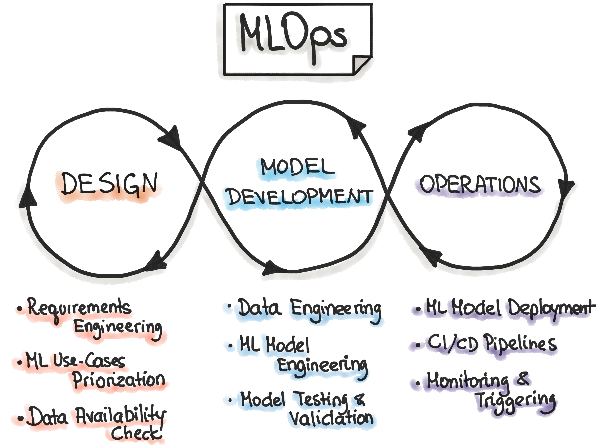

<!-- paginate: skip -->

<h1 class="section-header">Лекція 12</h1>

## Пайплайни машинного навчання, автоматизація підготовки даних

---

<!-- paginate: true -->

# Місце пайплайнів у ML-проєкті

Задачі машинного навчання майже ніколи не зводяться лише до вибору алгоритму та його тренування. Реальний ML-проєкт складається з послідовності взаємопов’язаних етапів: збору даних, очищення, трансформації, інженерії ознак, вибору моделі, навчання, валідації, оцінювання та подальшого використання у продакшені. Якщо ці етапи реалізовані некоректно виникають серйозні ризики: витік ознак, неконсистентність експериментів, неможливість відтворення результатів та помилки при масштабуванні.

**Пайплайн машинного навчання** — це формалізований спосіб представлення всього процесу навчання таким чином, що кожен крок чітко визначений, параметризований і може бути повторений. Автоматизація підготовки даних у межах пайплайну є ключовою умовою коректності ML-моделі.

---

# Формальна модель ML-пайплайну

З математичної точки зору пайплайн можна розглядати як композицію функцій.
Нехай початкові дані позначено як $X^{(0)}$, а кожен етап підготовки є відображенням:
$$
X^{(k+1)} = T_k(X^{(k)}),
$$
де $T_k$ — оператор трансформації (очищення, масштабування, кодування, відбору ознак тощо). Після $m$ послідовних перетворень отримуємо:
$$
X^{(m)} = (T_{m-1} \circ T_{m-2} \circ \dots \circ T_0)(X^{(0)}).
$$
Далі модель машинного навчання $f_\theta$ навчається на результаті:
$$
\hat{y} = f_\theta(X^{(m)}).
$$
Таким чином, повний пайплайн можна подати як єдину функцію:
$$
\mathcal{P}(X) = f_\theta(T_{m-1}(\dots T_0(X))).
$$

---

# Важливість автоматизації підготовки даних

Підготовка даних майже завжди містить параметри, що обчислюються зі статистик вибірки: середні значення, стандартні відхилення, медіани, квантилі, словники кодування категорій. Формально, такі параметри є оцінками:
$$
\hat{\mu} = \frac{1}{n} \sum_{i=1}^{n} x_i, \quad
\hat{\sigma}^2 = \frac{1}{n} \sum_{i=1}^{n} (x_i - \hat{\mu})^2.
$$

Якщо ці оцінки обчислюються з використанням усієї вибірки, включно з тестовою, виникає витік ознак.
Пайплайн повинен забезпечувати вимогу, що усі параметри трансформацій оцінюються лише на training-даних і лише потім застосовуються до validation та test.
Автоматизація гарантує, що одна і та сама логіка підготовки використовується на всіх етапах — від експериментів до робочого середовища.

---

# Типові компоненти пайплайну підготовки даних

Узагальнений пайплайн підготовки даних зазвичай включає кілька логічних блоків. Спочатку відбувається очищення, де реалізуються операції роботи з пропусками та аномаліями. Ці операції можна формалізувати як відображення:
$$
x_i' =
\begin{cases}
g(x_i), & \text{якщо } x_i \text{ допустиме}, \\
h({x_j}), & \text{якщо } x_i \text{ пропущене або аномальне}.
\end{cases}
$$
Далі застосовується масштабування або нормалізація, які перетворюють простір ознак, але не змінюють відносний порядок спостережень. Наприклад, стандартизація:
$$
x_i^{(scaled)} = \frac{x_i - \hat{\mu}}{\hat{\sigma}}.
$$

---

# Типові компоненти пайплайну підготовки даних

Наступним кроком часто є кодування категоріальних змінних, яке перетворює дискретні значення у векторний простір. One-Hot Encoding фактично реалізує відображення:
$$
c \in {1,\dots,K} \longrightarrow e_c \in \mathbb{R}^K,
$$
де $e_c$ — одиничний вектор.

Усі ці кроки повинні бути частиною єдиного автоматизованого ланцюга.

---

# Пайплайни та крос-валідація

Важливу роль пайплайни відіграють у поєднанні з k-fold крос-валідацією. Нехай вибірка розбита на $k$ фолдів $D_1, \dots, D_k$. Для кожної ітерації:
$$
D_{train}^{(i)} = \bigcup_{j \neq i} D_j, \quad D_{val}^{(i)} = D_i.
$$

Коректний процес вимагає, щоб усі трансформації навчалися заново на кожному $D_{train}^{(i)}$. Пайплайн забезпечує це автоматично, оскільки кожен виклик `fit` відбувається лише на тренувальній частині відповідного фолду. Без пайплайну така коректність практично недосяжна.

---

# Пайплайни та підбір гіперпараметрів

При підборі гіперпараметрів ми мінімізуємо оцінку ризику:
$$
\hat{R}(\lambda) = \frac{1}{k} \sum_{i=1}^{k} \mathcal{L}\bigl(f_{\theta(\lambda)}^{(i)}, D_{val}^{(i)}\bigr),
$$
де $\lambda$ — набір гіперпараметрів як моделі, так і трансформацій.
Пайплайн дозволяє розглядати параметри підготовки даних (наприклад, кількість компонент PCA або тип масштабування) як повноцінні гіперпараметри, що оптимізуються разом із параметрами моделі. Це принципово важливо, оскільки якість моделі в значній мірі залежить від підготовки даних, не тільки від вибору алгоритму.

---

# Пайплайни як захист від витоку ознак

З теоретичної точки зору витік ознак означає, що ми оцінюємо ризик:
$$
\hat{R}_{leak} = \mathbb{E}_{(x,y) \sim \mathcal{D}_{test}} \bigl[ \mathcal{L}(f_{\theta^*}(T_{\text{full}}(x)), y) \bigr],
$$
де $T_{\text{full}}$ навчений на повному датасеті. Це дає оптимістичну, але хибну оцінку.
Пайплайн гарантує, що оцінюється коректний ризик:
$$
\hat{R}_{true} = \mathbb{E}_{(x,y) \sim \mathcal{D}_{test}} \bigl[ \mathcal{L}(f_{\theta^*}(T_{\text{train}}(x)), y) \bigr].
$$

---

# MLOps

MLOps (Machine Learning Operations) — це міждисциплінарний підхід, який поєднує машинне навчання, інженерію програмного забезпечення та операційну підтримку з метою створення, розгортання та супроводу ML-моделей у реальних системах. На концептуальному рівні MLOps є аналогом DevOps, адаптованим до специфіки машинного навчання.

Ключова відмінність ML-систем від традиційного програмного забезпечення полягає в тому, що їх поведінка визначається не лише кодом, а й даними. Якщо у класичному програмному забезпеченні функція $y = g(x)$ повністю задається кодом, то у машинному навчанні вона має вигляд $y = f_\theta(x),$
де параметри $\theta$ отримуються шляхом оптимізації на даних. Отже, будь-яка зміна у даних, способі їх підготовки або в умовах застосування моделі може суттєво змінити поведінку системи навіть без змін у коді.

---

<!-- https://ml-ops.org/content/mlops-principles -->

---

# Основні задачі та проблеми, які вирішує MLOps

MLOps з’явився як відповідь на практичні труднощі, що виникають під час переходу від експериментальних моделей до промислового використання. Серед них — неможливість відтворити результати навчання, неконтрольований витік ознак, деградація якості моделі з часом, складність масштабування та відсутність прозорості рішень.

Формально, у MLOps ключовою є ідея контролю повного життєвого циклу моделі. Якщо позначити розподіли даних як $P_{train}(X, Y)$ та $P_{prod}(X, Y)$, то реальна система повинна бути здатною виявляти ситуації, коли
$$
P_{train} \neq P_{prod},
$$
і реагувати на це шляхом переналаштування або зупинки моделі. Без автоматизованих пайплайнів та моніторингу це завдання є складним.

---

# Роль пайплайнів у MLOps

У MLOps пайплайн машинного навчання розглядається не просто як зручний інструмент, а як формальний опис процесу перетворення "сирих" даних у прогноз. Математично пайплайн описується як композиція операторів:
$$
\mathcal{P} = f_\theta \circ T_{m-1} \circ \dots \circ T_0,
$$
де $T_i$ — трансформації даних, а $f_\theta$ — модель.

У межах MLOps кожна така композиція є версіонованим артефактом. Це означає, що модель у продакшені ніколи не існує окремо від пайплайну підготовки даних.

---

# Відтворюваність та контроль експериментів

Однією з фундаментальних вимог MLOps є відтворюваність. Для фіксованих даних, параметрів та версії пайплайну результат навчання має бути детермінованим. Це дозволяє пов’язати якість моделі з конкретними змінами в пайплайні, а не з випадковими флуктуаціями.

З формальної точки зору, це означає, що функція навчання
$$
\theta^* = \arg\min_\theta \mathcal{L}(f_\theta(T(X)), y)
$$
повинна бути стабільною відносно неістотних змін середовища виконання.

---

# Безперервне навчання та контроль дрейфу

У робочому середовищі пайплайн стає основою для безперервного навчання. Коли нові дані надходять у систему, ті самі трансформації $T$ застосовуються автоматично, що дозволяє коректно порівнювати нові спостереження з історичними.

Моніторинг статистик трансформованих ознак дозволяє виявляти data drift, тобто зміну розподілів або зв’язків між ознаками та ціллю. Це ключовий аспект MLOps, який складно реалізувати без чітко визначених пайплайнів.

---

# Пайплайни та Explainable AI

Explainable AI працює не з моделлю $f_\theta$ як такою, а з композицією $f_\theta \circ T$. SHAP, наприклад, будує адитивне представлення:
$$
f(T(x)) = \mathbb{E}[f(T(X))] + \sum_i \phi_i,
$$
де $\phi_i$ — внески трансформованих ознак.

Без явного пайплайну ці внески втрачають семантичну інтерпретацію, оскільки не зрозуміло, як саме були отримані ознаки, які пояснюються.

---

# Пайплайн як інструмент виявлення витоку ознак

Пояснюваність у поєднанні з пайплайнами дозволяє виявляти логічні та часові помилки в підготовці даних. Якщо, наприклад, SHAP-пояснення показують домінування ознак, що формуються після моменту прийняття рішення, це свідчить про темпоральний витік. Наявність пайплайну дозволяє точно локалізувати джерело цієї проблеми.
