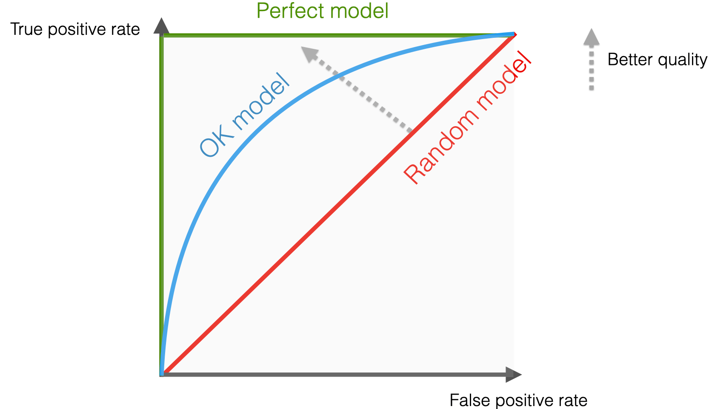
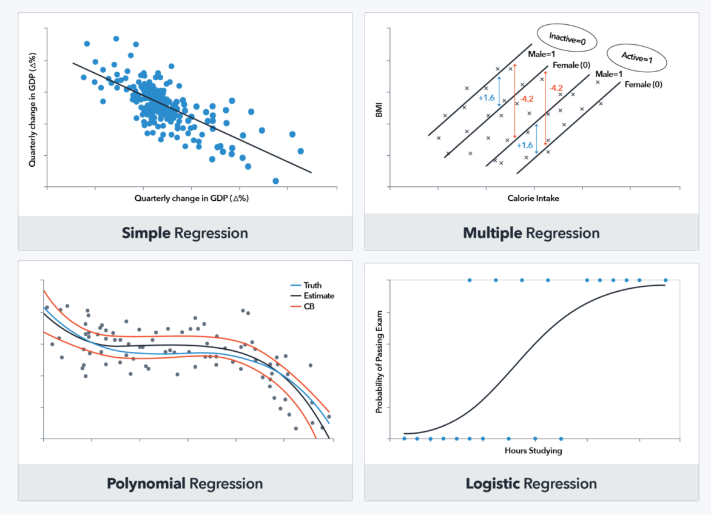
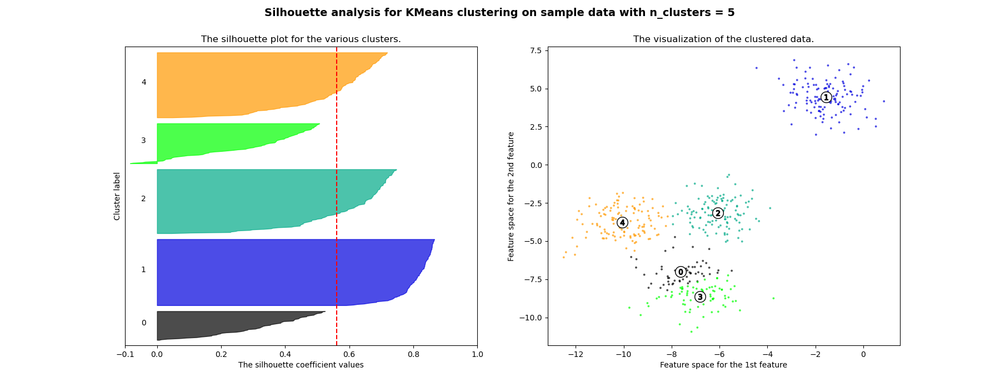
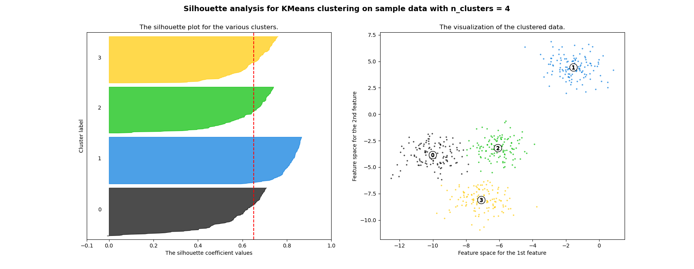

<!-- paginate: skip -->

<h1 class="section-header">Лекція 2</h1>

## Огляд завдань класифікації, регресії, кластеризації

---

# Вступ

<!-- paginate: true -->

У машинному навчанні існує величезна кількість методів і алгоритмів, однак майже всі практичні задачі зводяться до трьох фундаментальних напрямів: 
- **класифікації**,
- **регресії**
- **кластеризації**.

Відмінність між ними *визначається типом цільової змінної* та *наявністю або відсутністю міток* у даних.

---

# Вступ

- Якщо потрібно *передбачити чи є електронний лист спамом, чи ні (категорі.)*, то маємо справу із *задачею класифікації*.
- Якщо потрібно *оцінити числове значення*, як-от *вартість квартири*, то це *приклад регресії*.
- Якщо *дані не мають міток* і потрібно *знайти приховані структури*, як-от, *сегменти клієнтів за схожими характеристиками*, то *застосовується кластеризація*.

---

# Узагальнене формулювання задачі

У найзагальнішому вигляді задачу машинного навчання можна описати як *пошук функції відображення між простором ознак і простором вихідних змінних*.

- Нехай є множина об’єктів $X = \{x_1, x_2, \dots, x_n\}$, де кожен об’єкт описується вектором ознак $x_i \in \mathbb{R}^d$.
- Цільова змінна $y_i$ може бути неперервною, дискретною або зовсім невідомою.

---

# Узагальнене формулювання задачі

- Ми шукаємо функцію $f: \mathbb{R}^d \to Y$, яка на основі даних $(x_i, y_i)$ або лише $\{x_i\}$ наближає приховану залежність у даних. Тип простору $Y$ визначає постановку задачі:
  - Якщо $Y$ є скінченним множиною міток класів, маємо класифікацію.
  - Якщо $Y \subseteq \mathbb{R}$ або $\mathbb{R}^k$, маємо регресію.
  - Якщо $Y$ не заданий, а ми хочемо структурувати $X$ на групи, маємо кластеризацію.

---

# Узагальнене формулювання задачі

<!-- Empty space at the top -->
<!-- Empty space at the top -->
Таким чином: 
- класифікація - це пошук розбиття простору на області, які відповідають класам;
- регресія - це пощук наближення функціональної залежності $y=f(x)$;
- кластеризація - це пошук відношення подібності, що дозволяє групувати об’єкти.

Важливо, що всі ці задачі зводяться до однієї ключової ідеї:
> навчання функції $f$ за обмеженою вибіркою даних, яка узагальнює закономірності на нові, невідомі приклади.

---

# Класифікація

**Класифікація** – це задача, у якій ми маємо скінченний набір класів і на основі вхідних ознак прагнемо визначити, до якого саме класу належить приклад.

Формально, цільова змінна $y$ є дискретною і набуває значень з множини $\{1, 2, \dots, K\}$, де $K$ – кількість класів.

Завдання алгоритму полягає у побудові функції $f:\mathbb{R}^n \to \{1, \dots, K\}$, яка відображає вектор ознак у конкретний клас.

---

# Класифікація

Наприклад: 
- передбачення результату медичного тесту (позитивний чи негативний) є задачею бінарної класифікації з двома можливими виходами
- класифікація фотографій тварин на котів, собак і птахів – це вже багатокласова класифікація.

---

# Класифікація

Сучасні методи часто використовують ймовірнісну інтерпретацію. 

Замість прямого вибору класу вони прогнозують розподіл ймовірностей $P(y=k \mid \mathbf{x})$ для кожного можливого класу.

У випадку бінарної класифікації часто використовується логістична регресія. Ймовірність позитивного класу у ній задається функцією
$$
P(y=1 \mid \mathbf{x}) = \sigma(\mathbf{w}^\top \mathbf{x} + b) = \frac{1}{1 + e^{-(\mathbf{w}^\top \mathbf{x} + b)}},
$$
де $\sigma(z)$ – сигмоїдальна функція, яка відображає будь-яке дійсне число у інтервал $(0,1)$.

--- 

# Класифікація

А для багатокласової класифікації застосовується узагальнення
$softmax$-регресія:
$$
P(y=k \mid \mathbf{x}) = \frac{e^{\mathbf{w}_k^\top \mathbf{x}}}{\sum_{j=1}^K e^{\mathbf{w}_j^\top \mathbf{x}}},
$$
де кожен клас має власний вектор параметрів $\mathbf{w}_k$.

---

<h1 class="section-header"> Метрики для класифікації</h1>

---

# Accuracy

Оцінка якості класифікаційних моделей виконується за допомогою різних метрик.

У класифікаційних задачах найпростіша метрика – $Accuracy$ (точність класифікації), яка визначається як відношення кількості правильно класифікованих прикладів до загальної кількості прикладів:
$$
\text{Accuracy} = \frac{TP + TN}{TP + TN + FP + FN},
$$
де $TP$ – кількість істинно позитивних випадків, $TN$ – істинно негативних, $FP$ – хибно позитивних, а $FN$ – хибно негативних.

---

# Accuracy

Проте Accuracy працює, якщо дані є незбалансованими. Наприклад, коли позитивних прикладів значно менше за негативні.

У такому випадку часто розглядають дві метрики:
- $Precision$ (точність)
- $Recall$ (повнота).

---

# Precision

Точність показує, яка частка передбачених позитивних прикладів справді є позитивними:
$$
\text{Precision} = \frac{TP}{TP + FP}.
$$

---

# Recall

Повнота, навпаки, показує, яку частку реальних позитивних прикладів вдалося знайти:
$$
\text{Recall} = \frac{TP}{TP + FN}.
$$

---

# Precision vs Recall

$Precision$ та $Recall$ часто "конфліктують" між собою:
- висока точність може досягатися шляхом "обережних" передбачень (мало $FP$, але багато $FN$)
- висока повнота – шляхом "ризикованих" передбачень (мало $FN$, але багато $FP$).

---

# F1-score

Щоб знайти баланс між $Accuracy$ та $Recall$, використовують $F1$*-score*, що є гармонійним середнім:
$$
F_1 = 2 \cdot \frac{\text{Precision} \cdot \text{Recall}}{\text{Precision} + \text{Recall}}.
$$

---

# ROC-крива

Якщо модель прогнозує ймовірності, то для оцінки якості часто будують $ROC$-криву (Receiver Operating Characteristic), яка відображає залежність між часткою істинно позитивних ($TPR$) та хибно позитивних ($FPR$) при зміні порога класифікації.

Площа під $ROC$-кривою ($AUC$) є агрегованою метрикою: чим вона ближча до $1$, тим кращою є модель.

---

# ROC-крива

<a href="https://www.evidentlyai.com/classification-metrics/explain-roc-curve">джерело</a>

---

<h1 class="section-header">Регресія</h1>

---

# Регресія

Регресія вирішує задачу прогнозування неперервної числової змінної на основі вхідних ознак.

Формально, маємо функцію $f: \mathbb{R}^n \to \mathbb{R}$, яка відображає вектор ознак у дійсне число.

Прикладами є *прогноз вартості нерухомості за характеристиками квартири*, *передбачення кількості проданих товарів* або *оцінка рівня забруднення повітря*.

---

# Регресія

Найпростіша форма – це лінійна регресія, де передбачається, що залежність цільової змінної від вхідних ознак є лінійною.
Математично вона описується як
$$
\hat{y} = \mathbf{w}^\top \mathbf{x} + b,
$$
Регресія може бути як лінійною, так і нелінійною. Сучасні методи, такі як градієнтний бустинг або нейронні мережі, дозволяють будувати надзвичайно складні регресійні залежності, здатні враховувати взаємодії між ознаками та нелінійні ефекти.

---

# Регресія

---

<h1 class="section-header">Метрики для регресії</h1>

---

# MSE та RMSE

У регресії *основною метою є вимірювання відхилення прогнозів від реальних значень*. Найбільш поширеною є середньоквадратична помилка ($MSE$):
$$
\text{MSE} = \frac{1}{N}\sum_{i=1}^N (y_i - \hat{y}_i)^2,
$$
яка більше відкидає великі відхилення сильніше через піднесення у квадрат.

Корінь середньоквадратичної помилки ($RMSE$) більше надається до інтерпретації, оскільки вимірюється в тих самих одиницях, що й сама цільова змінна:
$$
\text{RMSE} = \sqrt{\text{MSE}}.
$$

---

# MAE

Середня абсолютна помилка ($MAE$) вимірює відхилення у середньому без піднесення у квадрат:
$$
\text{MAE} = \frac{1}{N}\sum_{i=1}^N |y_i - \hat{y}_i|.
$$
Вона більш стійка до викидів у даних.

---

# Коефіцієнт детермінації $R^2$

Ще однією важливою метрикою є коефіцієнт детермінації $R^2$, який показує, яка частка дисперсії у даних пояснюється моделлю:
$$
R^2 = 1 - \frac{\sum_{i=1}^N (y_i - \hat{y}_i)^2}{\sum_{i=1}^N (y_i - \bar{y})^2},
$$
де $\bar{y}$ – середнє значення цільової змінної. Значення $R^2$, близьке до 1, означає, що модель добре пояснює варіацію даних, а значення, близьке до 0, означає, що модель не краща за просте прогнозування середнього.

---

<h1 class="section-header">Кластеризація</h1>

---

# Кластеризація

Кластеризація належить до задач навчання без учителя, оскільки у даних відсутні цільові мітки.

*Мета полягає у тому, щоб розбити множину об’єктів на групи, або кластери*, так, щоб об’єкти
- всередині одного кластера були максимально подібні між собою
- а між різними кластерами – максимально відмінні.

---

# Кластеризація

Формально, для множини прикладів $\{\mathbf{x}_1, \dots, \mathbf{x}_N\}$ необхідно знайти розбиття на $K$ груп, що мінімізує деяку функцію невідповідності. Наприклад, у методі $k$-середніх цільова функція має вигляд:
$$
\sum_{i=1}^N \sum_{k=1}^K r_{ik} \|\mathbf{x}_i - \boldsymbol{\mu}_k\|^2,
$$
де $r_{ik}$ дорівнює $1$, якщо об’єкт $\mathbf{x}_i$ належить кластеру $k$, і $0$ інакше, а $\boldsymbol{\mu}_k$ – центр $k$-го кластера. Таким чином, алгоритм намагається зменшити суму квадратів відстаней усіх об’єктів до найближчих центрів кластерів.

---

# Кластеризація

Кластеризація має численні практичні застосування: 
- у маркетингу вона використовується для сегментації клієнтів за схожими характеристиками
- у біоінформатиці – для групування генів за функціональною подібністю
- в урбаністичних дослідженнях – для виявлення районів з подібними соціально-економічними характеристиками.

---

<h1 class="section-header">Метрики для кластеризації</h1>

---

# Метрики для кластеризації

Оскільки у задачах кластеризації зазвичай відсутні «правильні» мітки, якість оцінюють за допомогою внутрішніх показників.

---

# Коефіцієнт силуету

Одним з найбільш популярних є коефіцієнт силуету, який для об’єкта $i$ визначається як
$$
s(i) = \frac{b(i) - a(i)}{\max\{a(i), b(i)\}},
$$
де $a(i)$ – середня відстань від об’єкта $i$ до інших об’єктів у його кластері, а $b(i)$ – мінімальна середня відстань від об’єкта $i$ до об’єктів іншого кластера.

---

# Коефіцієнт силуету

Значення силуету варіюються $s(i) \in [1, 0]$.
Чим ближче значення до 1, тим краще об'єкт узгоджується з кластером і більше відокремлений від інших.
- $S(i) = 1$. Об'єкт повністю належить до свого кластеру, і відстань до інших кластерів значно більша.
- $S(i) = 0$. Об'єкт знаходиться на межі між двома кластерами, і неможливо чітко визначити, до якого з них він належить.
- $S(i)=−1$. Об'єкт належить до неправильного кластера, тобто його відстань до найближчого кластеру менша, ніж відстань до власного кластеру.

---

# Коефіцієнт силуету

---

# Коефіцієнт силуету

---

# Індекс Девіса–Болдіна

Ще одним показником є індекс Девіса–Болдіна (DBI):
$$
DBI = \frac{1}{K} \sum_{i=1}^K \max_{j \neq i} \frac{\sigma_i + \sigma_j}{d(c_i, c_j)},
$$
де $\sigma_i$ – середня відстань від точок у кластері $i$ до його центру $c_i$, а $d(c_i, c_j)$ – відстань між центрами кластерів.
Чим менший DBI, тим кращим є розділення кластерів.

---

# Внутрішні та зовнішні метрики

Коли ми виконуємо кластеризацію, то, як правило, у нас немає еталонних класів. У такому випадку якість кластерів оцінюють за допомогою внутрішніх метрик (силует, індекс Девіса–Болдіна тощо), які враховують лише структуру даних.

Проте в окремих завданнях може бути доступна "золота розмітка" (gold standard labels) – наприклад, якщо ми кластеризуємо тексти за темами, а нам відомо, яка стаття належить до якої рубрики. У такому випадку ми можемо оцінити, наскільки отримані кластери відповідають відомим класам. Метрики, що використовують таку інформацію, називають зовнішніми.

---

# Rand Index

Нехай у нас є множина $N$ об’єктів, які ми поділили на кластери. Також відома справжня класифікація. Ми можемо розглянути всі можливі пари об’єктів і подивитися, чи вони віднесені однаково у двох розбиттях:
- $a$ – кількість пар, які належать до одного кластера і в класифікації, і у прогнозованій кластеризації.
- $b$ – кількість пар, які належать до різних кластерів і в класифікації, і у прогнозованій кластеризації.
- $c$ – кількість пар, які належать до одного кластера у справжній класифікації, але в різні у кластеризації.
- $d$ – кількість пар, які належать до одного кластера у кластеризації, але в різні у справжній класифікації.

---

# Rand Index

Тоді $Rand Index (RI)$ визначається як частка "правильних" рішень:
$$
RI = \frac{a + b}{a + b + c + d}.
$$
$RI$ має значення від $0$ до $1$, де $1$ означає повну відповідність кластеризації еталонним класам.

---

# Проблема Rand Index

Недоліком Rand Index є те, що його значення може бути високим випадково, особливо якщо кластерів багато або їхня структура не збалансована. Наприклад, якщо всі об’єкти помістити в один кластер, то RI може дати не таке вже й низьке значення.

---

# Adjusted Rand Index (ARI)

Щоб уникнути проблем з Rand Index, використовують Adjusted Rand Index, який "віднімає" від Rand Index очікуване значення для випадкового групування і нормалізує результат.

Формула має вигляд:
$$
ARI = \frac{RI - \mathbb{E}[RI]}{\max(RI) - \mathbb{E}[RI]}.
$$
ARI змінюється від $-1$ до $1$:
- $ARI = 1$ – повна відповідність кластерів істинним класам;
- $ARI \approx 0$ – результат не кращий за випадкове розбиття;
- $ARI<0$ – кластеризація навіть гірша, ніж випадкова.

---

# Приклад ARI

Уявімо, що ми кластеризуємо зображення рукописних цифр (MNIST) без міток. 

Для цього ми порівнюємо кластери з реальними мітками цифр ($0–9$). Якщо кожен кластер приблизно відповідає одній цифрі, $ARI$ буде близьким до $1$. Якщо ж модель перемішала цифри, показник наблизиться до $0$.

Таким чином, ARI дозволяє оцінити, наскільки отримані кластери відповідають очікуваним класам, і при цьому враховує ефект випадковості.

---

<h1 class="section-header">Приклади завдань машинного навчання</h1>

---

# Прикладні задачі

Фактично кожне прикладне завдання у бізнесі, фінансах, медицині чи науці можна звести до оптимізаційної задачі: знайти параметри моделі, які мінімізують або максимізують певний функціонал.
Далі наведено кілька узагальнених формулювань для задач класифікації, регресії та кластеризації у різних сферах.

---

# Електронна комерція

- Коли ми передбачаємо, чи здійснить клієнт покупку, то маємо задачу класифікації. Нехай $x_i$ – вектор характеристик користувача (вік, частота відвідувань сайту, попередні покупки), а $y_i \in \{0,1\}$ – мітка класу («не купив», «купив»). Модель $f(x; \theta)$ з параметрами $\theta$ прогнозує ймовірність покупки. Задача формулюється як мінімізація логістичної втрати:
$$
L(\theta) = - \sum_{i=1}^N \left[ y_i \log f(x_i; \theta) + (1-y_i)\log(1-f(x_i; \theta)) \right].
$$

---

# Електронна комерція

- Коли ж потрібно спрогнозувати суму витрат клієнта, цільова змінна стає неперервною: $y_i \in \mathbb{R}^+$. Це вже регресія, і модель оцінюється через середньоквадратичну помилку:
$$
L(\theta) = \frac{1}{N}\sum_{i=1}^N (y_i - f(x_i; \theta))^2.
$$
- Сегментація клієнтів, формулюється як задача знаходження кластерів $\{C_1, \dots, C_K\}$, що мінімізують відстань до центрів:
$$
J = \sum_{k=1}^K \sum_{x_i \in C_k} \|x_i - \mu_k\|^2,
$$
де $\mu_k$ – центр $k$-го кластера.

---

# Кредитоспроможність

- Задача оцінки кредитоспроможності клієнта є класифікаційною.
  Для кожного клієнта маємо набір характеристик $x_i$ і бінарну змінну $y_i \in \{0,1\}$, що відображає факт дефолту чи відсутність дефолту. Функціонал аналогічний логістичній регресії або іншому класифікаційному методу.

---

# Аналіз активів

- Прогноз ціни активу на наступний день – це задача регресії, де модель $f(x; \theta)$ будує оцінку майбутньої ціни на основі попередніх значень. Оптимізаційна задача:
$$
L(\theta) = \sum_{i=1}^N (y_{i+1} - f(x_i; \theta))^2,
$$
де $y_{i+1}$ – реальна ціна у момент $i+1$.

- Групування інвесторів за схожими портфелями – це кластеризація. Мета – знайти структуру у множині векторів $x_i \in \mathbb{R}^n$, що відображають розподіл капіталу по активах. Використовується, наприклад, метод $k$-середніх або ієрархічна кластеризація.

---

# Охорона здоров’я

- Діагностика захворювання за результатами аналізів є класифікацією. Для кожного пацієнта маємо ознаки $x_i$ (аналізи, симптоми) та бінарну або мультикласову мітку $y_i$. Оптимізаційна задача формулюється як мінімізація крос-ентропійної втрати.

- Прогноз тривалості госпіталізації – це регресія, де вихідна змінна $y_i$ є неперервною (кількість днів). Функціонал втрат може бути MAE або MSE, залежно від вимог до точності та стійкості до аномалій.

- Кластеризація пацієнтів за симптомами або реакцією на лікування формулюється як знаходження груп $C_k$, у яких схожість усередині максимальна. Це дозволяє виявити патерни та робити персоналізовані рекомендації.

---

# Транспорт і міська аналітика

- Прогноз часу прибуття транспорту – регресійна задача, де функція $f(x_i; \theta)$ прогнозує час на основі таких ознак, як відстань, завантаженість доріг чи погода.

- Виявлення нетипових поїздок (наприклад, шахрайських викликів таксі) можна звести до класифікації, де мітка $y_i$ позначає «нормальна» чи «аномальна» поїздка.

- Кластеризація районів за транспортними потоками – це задача без учителя, яка формально записується як мінімізація дисперсії усередині кластерів транспортних характеристик.

---

# Наукові дослідження

- У фізиці віднесення сигналів до різних частинок – це класифікація з багатьма класами. Оптимізаційна задача – мінімізувати втрату крос-ентропії у багатокласовому випадку.

- Прогноз фізичних властивостей сполук – це регресія, де функція $f(x; \theta)$ відображає молекулярні дескриптори у реальні значення, наприклад, температуру кипіння.

- Групування генів у біоінформатиці – це кластеризація, що формулюється як задача знаходження груп із мінімальною внутрішньою дисперсією або максимальною подібністю за певною метрикою.

---

# Висновок

Усі ці приклади демонструють, що незалежно від сфери застосування, будь-яке завдання машинного навчання зводиться до формальної постановки оптимізаційної задачі.

Ми або мінімізуємо функцію втрат у класифікації та регресії, або шукаємо оптимальне групування у кластеризації.

Таке єдине бачення дозволяє ефективно переносити методи з однієї сфери в іншу, роблячи машинне навчання універсальним інструментом аналізу даних.

---

<h1 class="section-header">Проблеми задач машинного навчання

---

# Якість та обсяг даних

Будь-яка модель «настільки хороша, наскільки хороші дані». Пропуски, аномалії, шум або мала кількість прикладів можуть суттєво знизити якість. Наприклад, у задачі класифікації рідкісних хвороб (1% позитивних прикладів) модель може легко «навчитись» завжди передбачати «здоровий» і досягати 99% точності, але бути повністю марною.

---

# Дисбаланс класів і нерівномірність даних

У класифікації та регресії нерівномірне представлення різних підгруп призводить до зміщення моделі.
У кластеризації — деякі групи можуть бути надто великі або надто розмиті.

---

# Вибір ознак і масштабування

Неправильна або неповна репрезентація даних робить задачу нерозв’язною для моделі. У кластеризації масштаб ознак безпосередньо впливає на відстані й, відповідно, на структуру кластерів.

---

# Проблема перенавчання (overfitting) і недонавчання (underfitting

Занадто складні моделі можуть «запам’ятати» тренувальні дані й погано узагальнювати; занадто прості — не вловити залежності. Це класичний компроміс *bias–variance trade-off*.

---

# Інтерпретованість

Багато сучасних моделей (наприклад, ансамблі дерев або нейромережі) є «чорними скриньками». Для реальних застосувань (медицина, фінанси) критично важливо пояснювати, чому модель зробила певне передбачення.

---

# Обчислювальні ресурси

Великі дані й складні моделі вимагають значних ресурсів. Обчислювальна вартість може бути обмежуючим фактором навіть у академічних умовах.

---

# Залежність від постановки і метрик

Неправильний вибір метрики чи постановки задачі веде до некоректних результатів. Наприклад, мінімізація MSE у задачі з великими викидами часто призводить до поганих прогнозів, і доцільніше використовувати MAE.

