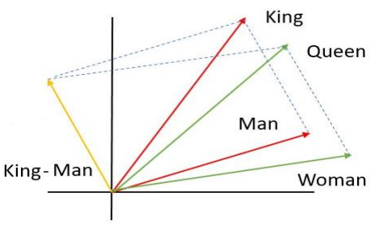

<!-- paginate: skip -->

<h1 class="section-header">Лекція 4</h1>

## Масштабування, нормалізація, кодування ознак

---

# Вплив ознак на успіх моделі

<!-- paginate: true -->

Очевидним є те, що архітектура моделі єдиним вирішальним критерієм її успіху. Але потрібно завжди також пам'ятати, що важливу роль також відіграє те як ми представили дані.
Нейронна мережа, градієнтний бустинг чи SVM можуть й не навчитися нічому корисному, якщо простір ознак не відображає суттєвих закономірностей предметної області.

---

Як зазначалося раніше, формально, модель машинного навчання — це функція  
$$  
f: \mathbb{R}^n \to \mathbb{R},  
$$
яка наближає залежність між вектором ознак $x = (x_1, \dots, x_n)$ та цільовою змінною $y$.  
Цей вектор — це *представлення об’єкта у математичному просторі*. Саме в цьому просторі обчислюються відстані, градієнти, скалярні добутки і т.д.

Отже, будь-яка трансформація ознак (масштабування, нормалізація, логарифмування, кодування категорій) насправді змінює геометрію простору, у якому живе модель. У цьому сенсі препроцесинг — це не допоміжний етап, а формування "топології" простору, у якому відбувається навчання.

---

# Приклади впливу масштабу і кодування

Розглянемо задачу класифікації клієнтів банку за ризиком кредиту. Маємо дві ознаки:
- $x_1$: вік клієнта (у роках, від 18 до 90),    
- $x_2$: дохід (у доларах, від 1000 до 100000).

Нехай ми використовуємо k-NN, де відстань між точками обчислюється за евклідовою метрикою:  
$$  
d(x_i, x_j) = \sqrt{(x_{i1} - x_{j1})^2 + (x_{i2} - x_{j2})^2}.  
$$

---

# Приклади впливу масштабу і кодування

Тоді зміна доходу на $10 000 дає внесок ($10000^2$), а зміна віку на 10 років — лише ($10^2$). Таким чином, *одна ознака переважає іншу на 4 порядки*.
Модель фактично "ігнорує" вік, бо його вплив на відстань незначний.

На графіку простору ознак це означає, що осі мають різний масштаб — замість кола рівновіддалених точок ми отримаємо еліпс, видовжений уздовж осі доходу. Тобто **метрика стає анізотропною**: відстані по різних напрямках не еквівалентні.

---

# Приклади впливу масштабу і кодування

Після масштабування (наприклад, через стандартне відхилення)  
$$  
x'_k = \frac{x_k - \mu_k}{\sigma_k},  
$$
обидві ознаки стають "співмірними".

Подібні ефекти спостерігаються і в інших алгоритмах:  
- у $PCA$ зміна масштабу змінює напрямки максимальних варіацій;  
- у $SVM$ — впливає на розташування гіперплощини;  
- у нейронних мережах — на стабільність градієнтів і швидкість збіжності.

Таким чином, навіть проста операція масштабування змінює топологію простору, в якому відбувається навчання.

---

# Поняття простору ознак, метрик і відстаней

Простір ознак — це $\mathbb{R}^n$ або його підмножина, у якій кожен об’єкт даних подано у вигляді вектора.  
Його геометрія визначається вибором метрики — функції  
$$
d: \mathbb{R}^n \times \mathbb{R}^n \to \mathbb{R}_{\ge 0},  
$$
що задовольняє властивості невід’ємності, симетрії та нерівності трикутника.

---

# Поняття простору ознак, метрик і відстаней

Найпоширенішими є:
- Евклідова відстань $d_2(x, y) = \sqrt{\sum_i (x_i - y_i)^2}$,
- Манхеттенська відстань $d_1(x, y) = \sum_i |x_i - y_i|$,
- Косинусна відстань $d_{\cos}(x, y) = 1 - \frac{\langle x, y \rangle}{|x||y|}$.

Ці різні метрики по-різному визначають “схожість” між точками.  
Якщо дві ознаки мають різні масштаби або одиниці вимірювання, то вибрана метрика перестає відображати істинну структуру даних — у геометричному сенсі, відстані між точками спотворюються.

---

# Спотворення геометрії даних

Розглянемо двовимірний простір ознак із координатами $(x_1, x_2)$, де $x_1$ має дисперсію 1, а $x_2$ — 10000.  
Матриця коваріації виглядає так:  
$$  
\Sigma =  
\begin{pmatrix}  
1 & 0 \\  
0 & 10000  
\end{pmatrix}.
$$  
Якщо ми вимірюємо відстань за стандартною евклідовою нормою, то точка на осі $x_2$ "рухається" у 100 разів швидше за точку на осі $x_1$. Геометрично ізолінії рівних відстаней (сфери) перетворюються на видовжені еліпси.

---

# Спотворення геометрії даних

У цьому сенсі *масштабування — це перетворення метричного тензора*.  
Якщо ми замінимо евклідову норму на махаланобісову:  
$$  
d_M(x, y) = \sqrt{(x - y)^\top \Sigma^{-1} (x - y)},  
$$  
ми фактично виконуємо масштабування осей обернено пропорційно до дисперсій. Це математично еквівалентно стандартному нормуванню ознак — тобто приводимо простір до ізотропного вигляду, де всі напрямки рівноправні.

Таким чином, масштабування це спосіб змінити метрику простору так, щоб вона відповідала реальній структурі варіацій у даних.

---

# Проблема категоріальних ознак

У багатьох реальних задачах дані містять не лише числові, а й категоріальні ознаки — тобто такі, що описують дискретні властивості об’єкта: колір, тип пристрою, місто, професію, бренд тощо. На відміну від числових, ці ознаки не мають природного порядку або метрики у звичному сенсі. Математично категоріальна ознака — це нечислова змінна  
$$ 
x^{(cat)} \in {c_1, c_2, \dots, c_m},  
$$
де $m$ — кількість можливих категорій, а самі категорії є лише мітками без відстані між ними.

---

# Неправильне числове представлення

Типова помилка початківців полягає в тому, що категорії кодують цілими числами, наприклад:  
$$
\text{red} = 1, \quad \text{green} = 2, \quad \text{blue} = 3.  
$$
На перший погляд це здається логічним, адже алгоритм потребує числових вхідних значень. Проте таке кодування несе в собі приховану структуру порядку та відстані, якої в даних насправді немає.

---

# Неправильне числове представлення

Для алгоритмів, що базуються на відстанях, наприклад k-NN, така репрезентація означає, що:  
$$
d(\text{red}, \text{green}) = |1 - 2| = 1,  
d(\text{green}, \text{blue}) = |2 - 3| = 1,
d(\text{red}, \text{blue}) = |1 - 3| = 2.
$$ 
Тобто модель сприймає "red" і "green" як ближчі між собою, ніж "red" і "blue". Але у вихідних даних не існує жодного об’єктивного порядку або відстані між цими кольорами.

Геометрично це означає, що ми вбудували категорії на числову вісь $\mathbb{R}$, де вони мають фіксоване розташування. Отже, модель розглядає простір із неіснуючою топологією: вона проводить межі, ґрунтуючись на помилковій геометрії, якої ніколи не було в даних. Для задач класифікації це може призвести до неправильного розділення класів або до зміщення в оцінці схожості між об’єктами.

---

# Вбудовування категорій з One-Hot Encoding

Щоб уникнути цієї проблеми, застосовують *one-hot encoding* — метод, який перетворює одну категоріальну змінну з m можливих значень у вектор із m вимірів. Для кожної категорії створюється окрема бінарна змінна:  
$$
\text{red} \to (1, 0, 0), \quad  
\text{green} \to (0, 1, 0), \quad  
\text{blue} \to (0, 0, 1).  
$$ 
Тепер простір ознак має розмірність $m$, а кожна категорія — це вершина одиничного симплексу в $\mathbb{R}^m$.

---

# Вбудовування категорій з One-Hot Encoding

Геометрично точки таких векторів розташовані на відстані:  
$$
d(x_i, x_j) = \sqrt{(1 - 0)^2 + (0 - 1)^2} = \sqrt{2},  
$$ 
незалежно від того, які саме категорії порівнюються. Це означає, що всі категорії рівновіддалені, як і має бути в дискретній невпорядкованій множині.

У термінах метричного простору one-hot encoding створює *ізометричне вкладення множини категорій* у евклідів простір, тобто зберігає властивість рівновіддаленості всіх елементів. Це усуває помилкові залежності, які виникали при простому числовому кодуванні.

---

# Перехід до неперервності у вбудуваннях

Коли кількість категорій дуже велика — наприклад, слова у текстах чи ID користувачів — one-hot encoding стає неефективним. Розмірність простору ознак може в цьому випадку дорівнювати кількості категорій, і обчислення стають надмірними.

У таких випадках застосовують *векторні embeddings* — компактні неперервні представлення, які вивчаються під час навчання моделі. Формально embedding — це функція  
$$
\phi: {c_1, c_2, \dots, c_m} \rightarrow \mathbb{R}^d,  
$$ 
де $d \ll m$, а координати $\phi(c_i)$ підбираються так, щоб у цьому просторі подібні категорії мали близькі вектори.

---

# Перехід до неперервності у вбудуваннях

Геометрично embeddings перетворюють множину дискретних міток у компактний многовид у $\mathbb{R}^d$, де з’являються _локальні відстані_ та _семантична близькість_. У нейронних мережах такі представлення формуються автоматично (наприклад, у Word2Vec, GloVe чи нейронних рекомендаційних-системах), і вони забезпечують *диференційовність простору ознак*, необхідну для градієнтного навчання.

Прикладом є відома властивість у мовних моделях:  
$$ 
\phi(\text{king}) - \phi(\text{man}) + \phi(\text{woman}) \approx \phi(\text{queen}),  
$$ 
що свідчить про те, що embedding-простір набуває _алгебраїчної структури_, якої не було у вихідній множині категорій.

---

# Перехід до неперервності у вбудуваннях

---

# Вплив на алгоритми машинного навчання

Коректне кодування категоріальних ознак має фундаментальне значення:
- У k-NN one-hot або embedding забезпечує рівновагу між категоріями: жодна не домінує у метриці.
- У $PCA$ некоректне числове кодування може створити штучні напрямки варіацій, тоді як one-hot зберігає ортогональність категорій.
- У $SVM$ one-hot encoding дозволяє лінійно розділяти категорії через стандартні ядра, тоді як числове кодування створює нелінійні й хибні гіперплощини.
- У нейронних мережах embeddings відкривають шлях до семантичного узагальнення — модель може переносити знання між схожими категоріями, навіть якщо вони ніколи не зустрічалися разом у тренувальних даних.

---

# Висновок

Проблема категоріальних ознак — це приклад того, як неправильна геометрична інтерпретація може негативно вплинути на узагальнювальну здатність моделі. Невдале кодування вводить у дані неіснуючі відстані, порушує ізотропність простору та спотворює навчальні сигнали. Навпаки, грамотне представлення — через one-hot, embeddings або спеціальні ядра — створює простір, у якому відстані відповідають реальній семантичній подібності, а отже, моделі навчаються на правильній геометрії.

---

# Попереднє опрацювання (Preprocessing)

Часто preprocessing сприймають як механічну рутину: заповнення пропусків, масштабування, нормалізація. Проте з точки зору теорії простору ознак це — *етап формування самої задачі навчання*.

Усі моделі — від лінійних регресій до глибоких нейронних мереж — оптимізують функції втрат, які обчислюються в просторі ознак. Якщо цей простір побудовано невдало, то навіть найкращий оптимізатор мінімізуватиме помилкову функцію.  

---

# Preprocessing

Іншими словами, preprocessing визначає не лише якість вхідних даних, а й *геометрію функції помилки*, тобто простір, по якому рухається алгоритм.

Практичний наслідок: у ML-пайплайні preprocessing повинен бути таким самим об’єктом дослідження й налаштування, як і вибір архітектури моделі. Неправильний preprocessing неможливо компенсувати «глибшою» або «потужнішою» мережею — це фундаментальна похибка у представленні простору.

---

# Зв’язок з bias–variance trade-off та узагальненням

Математично узагальнююча здатність моделі визначається розкладом очікуваної помилки:  
$$  
E[(y - \hat{f}(x))^2] = \text{Bias}^2 + \text{Variance} + \text{Noise}.  
$$  

---

Препроцесинг безпосередньо впливає на обидва перших доданки.
Якщо простір ознак занадто спрощений (наприклад, ми втратили інформацію через грубу нормалізацію або неправильне кодування), модель має високий *bias* — вона не здатна виразити істинну залежність.  
Якщо ж простір надмірно складний (наприклад, one-hot для категорії з 10 000 рівнів), виникає висока *variance* — модель перенавчається на випадкові варіації тренувальних даних.

Отже, preprocessing — це фактично *регулятор складності простору ознак*, який допомагає знайти баланс між гнучкістю моделі та її здатністю до узагальнення.

---

# Висновок

- Усе машинне навчання можна розглядати як побудову функції у певному просторі ознак.  
- Ми не просто навчаємо алгоритм — ми створюємо геометрію, у якій навчання стає можливим.  
- Масштабування, кодування, нормалізація, вибір метрики — це операції, що формують цей простір.  

---

<h1 class="section-header">Масштабування</h1>

---

# Min-Max Scaling

Для кожної ознаки $j$ та спостереження $i$:  
$$  
x_{ij}^{(mm)} = \frac{x_{ij} - \min_k x_{kj}}{\max_k x_{kj} - \min_k x_{kj}}, \qquad x_{ij}^{(mm)} \in [0,1]  
$$

### Геометрія

- Мінімальне значення ознаки стає 0, максимальне — 1.
    
- Всі точки лінійно стискаються в одиничний інтервал.
    
- Вектор відносних відстаней між точками залишається *пропорційним*, але абсолютний масштаб змінюється.
    
---

# Min-Max Scaling

### Вплив на моделі

- Добре для алгоритмів, де *важлива абсолютна відстань* (k-NN, k-means).
- Чутливий до *викидів*: якщо є екстремальні значення, більшість точок стискаються у вузький інтервал.
- Для нейромереж корисний, бо входи обмежені в $[0,1]$, що допомагає уникати насичуючих активацій (saturating activations) (sigmoid, tanh).

---

# Z-score стандартизація

$$ 
x_{ij}^{(std)} = \frac{x_{ij} - \mu_j}{\sigma_j}, \quad  
\mu_j = \frac{1}{n}\sum_{i=1}^n x_{ij}, \quad  
\sigma_j^2 = \frac{1}{n}\sum_{i=1}^n (x_{ij}-\mu_j)^2  
$$

### Статистика

- Очікуване значення ознаки після трансформації: $\mathbb{E}[x_{ij}^{(std)}] = 0$
- Дисперсія: $\mathrm{Var}(x_{ij}^{(std)}) = 1$
- Коваріаційна матриця стандартизованих ознак ($\Sigma_{std}$) збігається з кореляційною матрицею.
    

---

# Z-score стандартизація

### Геометрична інтерпретація
- Всі ознаки мають однакову «вагу» у просторі.
- Відстані між точками ($\mathbf{x}_i$, $\mathbf{x}_k$) обчислюються у *стандартизованому масштабі*, що усуває домінування ознаки з великою дисперсією:  
    $$  
    d_{ik}^2 = \sum_j \left(\frac{x_{ij}-x_{kj}}{\sigma_j}\right)^2  
    $$

---

# Z-score стандартизація

- PCA: стандартні компоненти визначаються *кореляцією*, а не дисперсією.    
- Регресія / градієнтні методи: збігаються швидше через *зменшення числа обумовленості* матриці $X^\top X$.
- SVM: нормалізація забезпечує збалансовані ваги для ознак.

---

# Робастне масштабування

$$  
x_{ij}^{(rob)} = \frac{x_{ij} - \mathrm{median}_j}{IQR_j}, \quad IQR_j = Q_{3,j} - Q_{1,j}  
$$

### Геометрія

- Центрування через медіану (не середнє).
    
- Масштабування через інтерквартильний розмах (IQR), тобто 50% центральних значень.
    
- Менше чутливий до *викидів*, ніж Min-Max або Z-score.
    
---

# Робастне масштабування

### Вплив на моделі

- Підходить для *даних із екстремальними значеннями*.
- Алгоритми на основі відстаней працюють коректніше, оскільки не дозволяють викидам «витиснути» основну масу точок.
- Для градієнтного спуску та регуляризації також забезпечує стабільніші оцінки ваг.
    

---

# Висновки

**Масштабування та нормалізація**:
- Усувають домінування ознак з великими дисперсіями.    
- Поліпшують збіжність алгоритмів градієнтного спуску.
- Забезпечують коректні відстані у k-NN, k-means, $SVM$.
- Сприяють стабільності регуляризованих моделей (L1, L2).
- Робастні методи корисні при наявності викидів, Min-Max підходить для нейромереж та алгоритмів, що працюють у [0,1], Z-score — для статистично «чистих» даних.

---

<h1 class="section-header">Нормалізація та перетворення розподілів

---

# Важливість нормалізації

Більшість алгоритмів машинного навчання — від лінійної регресії до $SVM$ і $PCA$ — припускають, що ознаки порівнянні між собою, тобто мають приблизно однакову *норму*, *масштаб* або *розподіл*.

Нормалізація — це не просто технічна операція. Це *геометричне перетворення простору ознак*, що впливає на форму, напрямки та довжини векторів. Залежно від мети, нормалізація може змінювати не лише масштаб, а й орієнтацію даних у просторі, роблячи їх більш придатними для подальшого аналізу.

---

# L1 та L2 нормалізація

Розглянемо вектор ознак $x = (x_1, x_2, \dots, x_n) \in \mathbb{R}^n$.  
Його норми визначаються так:  
$$  
|x|_1 = \sum_{i=1}^n |x_i|, \quad  
|x|_2 = \sqrt{\sum_{i=1}^n x_i^2}.  
$$

---

# L1 нормалізація

*L1-нормалізація* (або нормалізація за сумою модулів) масштабує вектор так, що його координати задовольняють:  
$$  
x'_i = \frac{x_i}{|x|_1}, \quad \text{тобто} \quad \sum_i |x'_i| = 1.  
$$  
Вектор після L1-нормалізації лежить на *гіперплощині*, що відповідає сумі модулів = 1. Геометрично це багатогранник (у 2D — ромб, у 3D — октаедр).

---

# L2 нормалізація

*L2-нормалізація* (нормалізація за евклідовою довжиною) забезпечує:  
$$
x'_i = \frac{x_i}{|x|_2}, \quad \text{тобто} \quad \sum_i (x'_i)^2 = 1.  
$$  
Тепер усі вектори розташовані на *одиничній сфері* в $\mathbb{R}^n$.  
Це має пряме геометричне значення: після L2-нормалізації всі точки мають однакову довжину, і відстані між ними залежать лише від *кутів*, а не від довжин.

---

# Косинусна відстань

Косинусна схожість між двома векторами (x) і (y) визначається як  
$$
\cos(\theta) = \frac{\langle x, y \rangle}{|x|_2 |y|_2},  
$$  
де $\langle x, y \rangle$ — скалярний добуток, а $\theta$ — кут між векторами.

Якщо обидва вектори мають одиничну довжину ($|x|_2 = |y|_2 = 1$), то  
$$
\cos(\theta) = \langle x, y \rangle,  
$$  
а отже, *подібність* між об’єктами визначається лише напрямками, без урахування масштабу.

---

# Косинусна відстань

Це особливо важливо в текстовій аналітиці (TF–IDF), у задачах зображень та рекомендацій, де відносні пропорції ознак важливіші за абсолютні значення.  
L2-нормалізація в такому випадку — спосіб привести всі об’єкти на поверхню одиничної сфери, де «близькість» вимірюється за кутом між векторами.

У результаті, *L2-нормалізація фактично переводить задачу у сферичний простір*, де відстань між точками визначається косинусною метрикою:  
$$
  d_{\cos}(x, y) = 1 - \langle x, y \rangle.  
$$

---

# Логарифмічні та степеневі перетворення

Часто ознаки мають *сильно "зсунуті" розподіли* — наприклад, доходи, кількість кліків або площа нерухомості.  
Якщо такі дані подавати без змін, моделі, що передбачають нормальність залишків (лінійна регресія, PCA, GaussianNB), працюватимуть некоректно.

Для вирівнювання асиметрії використовують *логарифмічні та степеневі трансформації*, які стискають великі значення та розтягують малі.

---

# Логарифмічна трансформація

$$
x' = \log(x + c),  
$$  
де $c > 0$ — константа для уникнення $\log(0)$.  
Якщо початковий розподіл має довгий правий хвіст (наприклад, експоненціальний), то після логарифмування він наближається до нормального.

---

# Box–Cox трансформація

Визначається як  
$$
x'(\lambda) =  
\begin{cases}  
\dfrac{x^\lambda - 1}{\lambda}, & \lambda \ne 0, \\  
\log(x), & \lambda = 0.  
\end{cases}  
$$ 
Це параметричне сімейство перетворень, яке підбирає оптимальний параметр ($\lambda$), що *максимізує нормальність* (зазвичай за критерієм максимуму лог-правдоподібності для нормального розподілу).  
Box–Cox вимагає ($x > 0$), тому для даних із нулями або від’ємними значеннями використовують його узагальнення.

---

# Yeo–Johnson трансформація

$$
x'(\lambda) =  
\begin{cases}  
\dfrac{((x+1)^\lambda - 1)}{\lambda}, & x \ge 0, \lambda \ne 0, \\  
-\dfrac{((-x+1)^{2-\lambda} - 1)}{2-\lambda}, & x < 0, \lambda \ne 2.  
\end{cases}  
$$ 
Yeo–Johnson — симетричне узагальнення Box–Cox, яке працює з будь-якими дійсними значеннями $x$.  
Воно дозволяє «випрямити» як правосторонню, так і лівосторонню асиметрію, не вимагаючи зсуву даних.

---

# Вплив трансформації на симетрію та нормальність

Нехай випадкова змінна $X$ має щільність $f(x)$ із сильною асиметрією.  
Після трансформації $Y = g(X)$ щільність змінюється за правилом:  
$$
f_Y(y) = f_X(g^{-1}(y)) \cdot \left| \frac{d}{dy} g^{-1}(y) \right|.  
$$ 
Якщо $g(x)$ є монотонно зростаючою функцією, то форма розподілу може бути радикально змінена — наприклад, при $g(x) = \log(x)$ великі значення стискаються, а малі розтягуються.

---

# Вплив трансформації на симетрію та нормальність

Мета таких трансформацій — *зменшити асиметрію/перекіс (skewness)* і *наблизити розподіл до нормального*.  
Це підвищує стабільність статистичних методів, зменшує вплив викидів та покращує збіжність алгоритмів оптимізації, які передбачають гладку, симетричну поведінку функції втрат.

---

# Роль нормалізації в PCA

У PCA ми шукаємо напрямки максимального розсіювання даних.  
Нехай $X$ — матриця даних із нульовим середнім. PCA знаходить власні вектори матриці коваріації:  
$$
\Sigma = \frac{1}{n} X^\top X.  
$$ 
Якщо ознаки не нормалізовано, то їхні дисперсії мають різний масштаб, і головні компоненти будуть доміновані тими ознаками, що мають найбільшу варіацію.

---

# Роль нормалізації в PCA

Після нормалізації (наприклад, через Z-score)  
$$
x'_i = \frac{x_i - \mu_i}{\sigma_i},  
$$ 
всі ознаки мають однакову дисперсію (1), і PCA аналізує *структуру кореляцій*, а не абсолютні масштаби.

Геометрично це означає, що ми спочатку «розтягуємо» осі, щоб усі мали однакову вагу, а вже потім шукаємо напрямки найбільшої варіації у цьому ізотропному просторі.

---

# Роль нормалізації в SVM

У Support Vector Machines функція оптимізації має вигляд:  
$$
\min_{w,b} \frac{1}{2}|w|_2^2 + C \sum_i \xi_i,  
$$ 
де $|w|_2$ — норма вектора ваг.  
Якщо ознаки мають різні масштаби, координати з великими значеннями отримують більші коефіцієнти у $w$, а гіперплощина розділення перекошується в їхній бік.

---

# Роль нормалізації в SVM

Нормалізація гарантує, що кожна ознака робить порівняний внесок у відстань до гіперплощини:  
$$
d(x) = \frac{|w^\top x + b|}{|w|_2}.  
$$ 
Без нормалізації ця відстань втрачає сенс — одиниці вимірювання різних ознак спотворюють геометрію.  
Таким чином, нормалізація у SVM — не формальність, а *необхідна умова коректного визначення метрики відстаней до гіперплощини*.

---

# Роль нормалізації у нейронних мережах

У нейронних мережах нормалізація використовується для стабілізації градієнтів і прискорення збіжності.  
Якщо вхідні ознаки мають різні масштаби, то на першому шарі деякі ваги отримують великі градієнти, інші — малі, що призводить до нестабільності навчання.

---

# Batch нормалізація

Для кожного шару нормалізують вихідні активації:  
$$
\hat{x} = \frac{x - \mu_{\text{batch}}}{\sigma_{\text{batch}}}.  
$$ 
Потім додають параметри масштабування і зсуву $(\gamma, \beta)$, щоб мережа могла відновити оптимальний розподіл. Фактично підтримує дані у стані, близькому до стандартного нормального розподілу $N(0,1)$, що забезпечує стабільні градієнти по всіх шарах.

### Layer нормалізація, Instance нормалізація, Group нормалізація

Ці варіанти нормалізації виконуються не по міні-батчу, а по інших осях тензора, зберігаючи основну ідею — стабільність та уніфікацію статистичних властивостей ознак.

---

# Висновок

Нормалізація — це не просто процес "вирівнювання чисел". З математичної точки зору, це *перетворення базису та метрики простору ознак*, яке змінює форму, орієнтацію і масштаби даних.  
Через нормалізацію ми контролюємо геометрію простору алгоритму:
- у $PCA$ — визначаємо напрямки варіацій,
- у $SVM$ — встановлюємо "справедливу" метрику,
- у нейронних мережах — стабілізуємо потік градієнтів,
- у косинусній подібності — проектуємо дані на одиничну сферу.

Отже, *нормалізація — це фундаментальний інструмент керування геометрією даних*, який дозволяє зробити простір ознак гармонійним, ізотропним і придатним для коректного навчання моделей.
