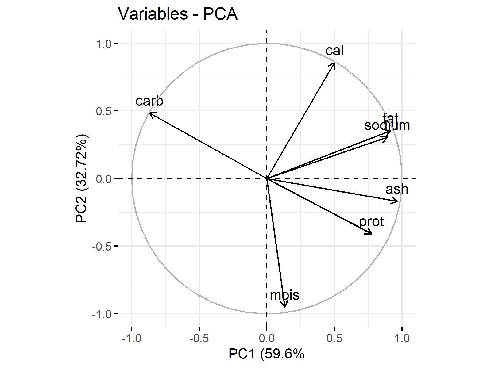
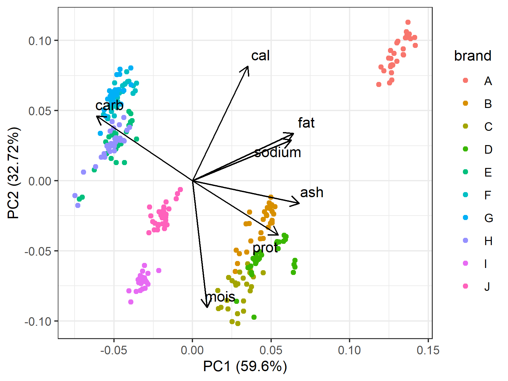
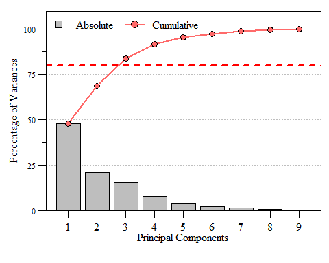

<!-- paginate: skip -->

<h1 class="section-header">Лекція 5</h1>

## Генерація ознак, зменшення розмірності (PCA, t-SNE, UMAP)


---

# Вступ

<!-- paginate: true -->

Інженерія ознак — це ключовий етап машинного навчання, який часто визначає успіх моделі більше, ніж вибір алгоритму. Генерація ознак (feature generation) та зменшення розмірності (dimensionality reduction) — це два взаємопов’язані напрями, що дозволяють збільшити інформативність даних або зменшити їхню складність без втрати суттєвої інформації.


---

# Вступ

Більшість реальних наборів даних містять ознаки, які є надмірними, корельованими або неінформативними. Такі ознаки не лише збільшують обчислювальну складність, але й знижують здатність моделі до узагальнення. Завдання аналітика — перетворити "сирі" дані у збалансований простір ознак, де кожна компонента несе нову, релевантну інформацію.


---

<h1 class="section-header">Генерація ознак</h1>

---

# Формальний опис

Генерація ознак — це процес створення нових змінних на основі існуючих, що допомагають краще відобразити закономірності у даних.  
Формально, якщо вхідний простір має вигляд:  
$$
X = [x_1, x_2, \dots, x_d],  
$$  
то нова ознака може бути побудована як:  
$$ 
x_{new} = f(x_1, x_2, \dots, x_d),  
$$ 
де $f(\cdot)$ — функція трансформації.


---

# Мета

Метою є:
- збільшення інформативності ознакового простору;
- підсилення взаємозв’язків між даними та цільовою змінною;
- компенсація відсутніх чи непрямо спостережуваних факторів.

Приклад: у фінансових даних значення доходу та витрат окремо можуть бути малоінформативними, тоді як відношення доходу до витрат
$$
r=\frac{income}{expences}
$$
безпосередньо характеризує рівень добробуту.


---

# Основні типи генерації ознак

Генерація ознак — це творчий процес, який часто базується на предметних знаннях. Важливо не просто створювати нові змінні, а **розуміти, яку закономірність вони можуть відобразити**.
Нижче наведено основні типи генерації ознак із короткими поясненнями та прикладами практичного застосування.


---

# Арифметичні перетворення

Ідея полягає у створеннв ознак на основі простих математичних співвідношень між наявними змінними.
Такі ознаки часто мають зрозумілу інтерпретацію і покращують зв’язок між даними та цільовою змінною.

**Приклад:** у наборі даних продажів маємо $price$ і $quantity$ можемо створити нову ознаку $price_{per\,item}$, яка показує середню ціну одиниці товару.
$$
price_{per\,item} = \frac{\sum_{i=1}^{P}{price_{i}}}{quantity}.
$$
Ця ознака зменшує вплив великих обсягів замовлень і допомагає моделі оцінювати “типову” ціну незалежно від кількості.


---

# Поліноміальні ознаки


Додавання степеневих і комбінаційних термів для моделювання нелінійних зв’язків.
Поліноміальні ознаки розширюють простір ознак, дозволяючи лінійним моделям навчатися нелінійним залежностям.

$$
x_{poly} = [x_1^2, x_2^2, x_1x_2, \dots].
$$

**Приклад:** залежність площі $area$ від кількості кімнат $rooms$

$$
X_{poly}​=[area, rooms, area^2, area*rooms, rooms^2]
$$

Тут припущено, що ціна житла нелінійно залежить від площі, додавання наприклад $area^2$ дозволяє моделі краще уловити цей ефект.


---

# Часові ознаки

Часові мітки містять багато прихованих закономірностей (день тижня, сезон, година доби, тренд). Їх часто потрібно декомпонувати.

**Приклад:** дані про поїздки таксі; нехай у нас єчас посадки $pickup_datetime$, тоді ми можемо виділити такі ознаки як година $hour$, день тижня $day_of_week$, чи вихідний $is_weekend$.

Тут виражено залежність попиту на таксі від години дня чи вихідних може суттєво впливати на прогноз кількості замовлень.
Такі ознаки дозволяють моделі виявляти сезонні закономірності.


---

# Агреговані ознаки

Створення статистичних узагальнень за групами — середніх, медіан, кількостей.
Це особливо корисно для даних із повторюваними ідентифікаторами (користувачі, магазини, регіони).

**Приклад:** дані e-commerce і обчислення середнього, кількості, стандартного видхілення від кількості покупок.

Таким чином ми додаємо профільну інформацію про кожного користувача: як часто він купує ($count$), скільки витрачає ($mean$) і наскільки його покупки варіативні ($std$).


---

# Кодування категоріальних змінних

Так як більшість моделей працюють лише з числовими ознаками, тому категорії потрібно перетворити у числову форму.

#### One-Hot Encoding

Створює окрему бінарну змінну для кожної категорії.
```python
df = pd.get_dummies(df, columns=['region'])
df['region_vec'] = one_hot.values.tolist()
```

Кожен стовпець відповідає конкретному регіону.
Метод ефективний для невеликої кількості категорій, але створює багато стовпців при великій кардинальності.


---

# Кодування категоріальних змінних

#### Frequency Encoding

Кодує категорію за її частотою в наборі даних.

```python
freq = df['region'].value_counts(normalize=True)
df['region_freq'] = df['region'].map(freq)
```

Категорії, що зустрічаються частіше, отримують більші значення.
Такий метод не роздуває кількість ознак і добре підходить для великих категоріальних змінних.


---

# Кодування категоріальних змінних

#### Target Encoding

Замінює категорію на середнє значення цільової змінної для неї.

```python
mean_target = df.groupby('region')['target'].mean()
df['region_enc'] = df['region'].map(mean_target)
```

Цей метод вводить статистичну інформативність, але слід обережно застосовувати і потрібно крос-валідувати.


---

# Ознаки взаємодії

Ідея полягай у поєднанні двох або більше ознак для моделювання їх спільного впливу на результат.

**Приклад:**

$$
temp_{rain interaction} = temperature * rainfall
$$
Якщо врожайність залежить і від температури, і від опадів, то їхній добуток може краще відображати “оптимальні” умови росту.

Інший приклад це $income × education level$, який може бути кращим індикатором фінансової стабільності, ніж кожна змінна окремо.


---

# Ознаки з текстів, зображень, сигналів

#### Текст

Можна перетворити у числовий вектор за допомогою TF-IDF.
TF-IDF оцінює, наскільки слово є унікальним у документі:
$$
\text{tf-idf}(t,d) = tf(t,d) \cdot \log\frac{N}{df(t)}.
$$


---

# Ознаки з текстів, зображень, сигналів

#### Зображення

Для зображень часто використовують **PCA** або ознаки, згенеровані нейронними мережами (наприклад, ResNet embeddings).


---

# Ознаки з текстів, зображень, сигналів

#### Сигнали

Для часових сигналів — частотні ознаки через **перетворення Фур’є (FFT)** або **wavelet-трансформації**, що виділяють частотні патерни:
$$
X_f = \mathcal{F}(x_t) = \sum_{t=0}^{N-1} x_t e^{-i2\pi ft/N}.
$$


---

# Ознаки на основі рангу або порядку

Замінює значення на їхній ранг, що знижує вплив викидів і масштабів.

$$
\text{rank}(x_i) = 1 + CNT(x_j < x_i) + \frac{1}{2} CNT(x_j = x_i, j \neq i)  
$$

Ранги добре працюють у випадках, коли абсолютне значення не так важливе, як відносна позиція (наприклад, місце користувача в топі покупців).


---

# Геопросторові ознаки

Для даних з координатами можна обчислити:
* **відстань** між точками (за формулою Гаверсайна):
  $$
  d = 2R \arcsin \sqrt{\sin^2\left(\frac{\Delta \phi}{2}\right) + \cos(\phi_1)\cos(\phi_2)\sin^2\left(\frac{\Delta \lambda}{2}\right)}.
  $$
* **щільність точок** у певному радіусі (feature density).
* **кластерні ознаки** через KMeans або DBSCAN.

Наприклад у транспортних чи комерційних задачах відстань до центру міста чи аеропорту часто є ключовою предиктивною ознакою.


---

# Логарифмічні та Box-Cox перетворення

Ідея полягає у перетворенні для зменшення асиметрії розподілу ознаки (наближення до нормального).
Це робить моделі стійкішими до великих значень.

$$
x' = \log(x + 1) \quad \text{або} \quad x' = \frac{x^\lambda - 1}{\lambda}.
$$

Логарифм стискає великі значення і вирівнює дисперсію, що покращує роботу регресійних моделей.


---

# Висновок

Генерація ознак — це не просто набір технік, а процес інтелектуального “збагачення” даних.
Хороша ознака:
- має зрозуміле тлумачення,
- зменшує невизначеність (ентропію),
- підвищує лінійність або відокремлюваність класів,
- не дублює інформацію з інших ознак.


---


<h1 class="section-header">Зниження розмірності</div>


---

# Поняття та роль розмірності

У машинному навчанні кожен об’єкт описується вектором ознак  
$$
x_i=[x_{i1},x_{i2},\ldots,x_{id}],  
$$ 
де $d$ — кількість ознак (вимірів).  
Якщо $d$ велике, ми стикаємося з “прокляттям розмірності” (_curse of dimensionality_).  
Збільшення розмірності призводить до експоненційного зростання обсягу простору: дані розріджуються, а будь-яка точка стає «далекою» від будь-якої іншої. Алгоритми, що спираються на відстані або густину, починають працювати гірше, а візуалізувати дані стає неможливо.


---

# Поняття та роль розмірності

Зменшення розмірності дозволяє:
- знизити шум і кореляцію між ознаками;
- прискорити навчання моделей;
- виявити приховані фактори, які пояснюють структуру даних;
- створити дво- чи тривимірні представлення для візуалізації.


---

# Формальна постановка задачі

Задача полягає в тому, що потрібно знайти відображення  
$$
f:\mathbb{R}^d\rightarrow\mathbb{R}^k,\qquad k\ll d,  
$$
яке перетворює матрицю даних $X\in\mathbb{R}^{n\times d}$ у нову матрицю $Z=f(X)\in\mathbb{R}^{n\times k}$,  зберігаючи при цьому найважливішу інформацію про структуру простору.


---

# Principal Component Analysis (PCA)


PCA шукає нові ортогональні осі — головні компоненти,  вздовж яких варіація даних максимальна.  Це обертання системи координат так, щоб перша вісь пояснювала найбільшу дисперсію,  друга — другу за величиною тощо.
Наприклад у даних про житло перша компонента може відображати “розмір і площу”, а друга — “розташування й престижність району”.


---

# Математичні основи

Для центрованої матриці $X$ коваріаційна матриця:  
$$
\Sigma=\frac{1}{n-1}X^\top X.  
$$
Знаходимо власні вектори $v_i$ та власні значення $\lambda_i$:  
$$
\Sigma v_i=\lambda_i v_i.  
$$
Власні значення впорядковують за спаданням, і перші $k$ власних векторів утворюють матрицю $V_k=[v_1,\ldots,v_k]$.
Нові координати тоді можна задати так:  
$$
Z=X V_k.  
$$


---

# Геометрична інтерпретація

Хмара точок у просторі має форму еліпсоїда. PCA обертає координатну систему так, щоб перша вісь еліпсоїда збігалася з найбільшою віссю розкиду.  
Після проекції на кілька головних осей ми отримуємо спрощену, але суттєву картину даних.


---

# Геометрична інтерпретація

<div class="bottom-text"><a href="https://statisticsglobe.com/principal-component-analysis-pca">джерело</a></div>






---

# Вибір кількості компонент

Використовується частка поясненої дисперсії:  
$$
r_k=\frac{\sum_{i=1}^{k}\lambda_i}{\sum_{j=1}^{d}\lambda_j}.  
$$  
Зазвичай беруть $r_k\ge0.9$, тобто $90\%$ варіації збережено.  
На практиці це видно на графіках «Scree Plot / Explained Variance Plot», де після певного номера компонент крива “загинається” — точка зламу і є раціональним $k$.


---

# Вибір кількості компонент




---

# Висновок

- PCA зберігає глобальну структуру даних, а саме ефективно зменшує розмірність, зберігаючи основні варіації в даних, що дозволяє виокремити ключові фактори.
- PCA є швидким і простим у використанні, однак він втрачає частину локальної структури, оскільки фокусується на максимізації варіації, а не на збереженні зв'язків між сусідніми точками.


---

# Приклади

- Фінансові дані. Перша компонента PCA може вловлювати загальний ринковий тренд, відображаючи коливання акцій, що корелюють з індексами, наприклад, S&P 500.
- Зображення. У зображеннях PCA може виділяти основні характеристики, такі як освітленість або напрямок тіні, що допомагає розпізнавати контури та деталі.
- Тексти (TF-IDF). Для текстів PCA дозволяє виділити основні теми чи підтемні контексти, виявляючи, наприклад, континуум між економічними та політичними темами.


---

# t-Distributed Stochastic Neighbor Embedding

t-SNE створює відображення, у якому точки, близькі у вихідному просторі, залишаються близькими і після проєкції, тоді як далекі точки можуть розходитися довільно.  
Таким чином зберігаються _локальні структури_, але не глобальні відстані.


---

# Ймовірнісна модель

У вихідному (високовимірному) просторі для кожної пари точок $x_i$ і $x_j$ обчислюється ймовірність того, що вони є сусідами:  
$$
p_{ij} \propto \exp\left(-\frac{|x_i - x_j|^2}{2\sigma_i^2}\right).  
$$ 
Вона показує, наскільки близькими є точки у початкових даних.


---

# Ймовірнісна модель

Далі ті самі точки переносяться у зменшений простір — простір меншої розмірності (наприклад, з 1000 вимірів до 2 або 3).  
У цьому просторі кожній точці відповідають нові координати $y_i$, а подібність між ними визначається як  
$$
q_{ij} \propto \frac{1}{1 + |y_i - y_j|^2}.  
$$


---

# Ймовірнісна модель

Мета алгоритму полягає в тому, щоб зробити подібності у зменшеному просторі $q_{ij}$ максимально схожими на подібності у вихідному просторі $p_{ij}$.
Для цього мінімізується розбіжність Кульбака–Лейблера між цими двома розподілами:  
$$
C = \sum_{i \neq j} p_{ij} \log \frac{p_{ij}}{q_{ij}}.  
$$


---

# Пояснення

Припустімо, кожен об’єкт (наприклад, зображення або людина) описується великою кількістю чисел — 100.  
Кожен такий набір чисел можна уявити як точку у багатовимірному просторі:  
$$  
x_i = (x_{i1}, x_{i2}, \dots, x_{i100}).  
$$
Цей простір настільки складний, що його неможливо намалювати або інтуїтивно уявити.


---

# Пояснення

Алгоритм t-SNE спочатку оцінює, наскільки дві точки схожі між собою у вихідному просторі.  
Якщо вони дуже близькі, то $p_{ij}$ — велике,  якщо далекі — $p_{ij}$ маленьке.  В результаті ми отримуємо ймовірнісний опис структури даних.
Далі кожній точці $x_i$ призначають нові координати $y_i$ у площині (наприклад, випадкові).  
Ці точки тепер існують у низькорозмірному просторі — тобто мають лише 2 координати.


---

# Висновок

t-SNE добре “розкриває” локальні групи у візуалізації з’являються окремі “острови” — кластерні структури. Проте відстані між цими островами не мають кількісного значення. Тобто кластери правильні, але їхня взаємна позиція випадкова.


---

# Приклади

- Embeddings слів (Word2Vec). t-SNE допомагає візуалізувати семантичні групи слів — наприклад, слова зі схожим значенням або контекстом розташовуються поруч.
- E-commerce. Для поведінкових даних клієнтів t-SNE показує природні групи покупців, наприклад, “часті покупці” чи “цінові мисливці”.
- Рукописні цифри (MNIST). Алгоритм дозволяє побачити окремі кластери цифр (0–9), чітко відокремлені в просторі ознак.
t-SNE показує, які групи існують, але не відображає, як вони пов’язані між собою.


---

# Uniform Manifold Approximation and Projection

UMAP базується на припущенні, що дані лежать на многовиді (гладкій поверхні меншої розмірності).  Метод будує граф локальних сусідств і знаходить проєкцію, яка зберігає топологію цього графа.


---

# Короткий опис алгоритму

Створення графа $G_P$ у високорозмірному просторі. Для кожної пари точок $(x_i, x_j)$ обчислюється ймовірність $p_{ij}$, яка відображає їх відстань в оригінальному просторі.
$$
p_{ij} = \frac{\exp(-d(x_i, x_j)^2 / \sigma_i^2)}{\sum_{k \neq i} \exp(-d(x_i, x_k)^2 / \sigma_i^2)}
$$


---

# Короткий опис алгоритму

Створення графа $G_Q$ у просторі меншої розмірності. Будується граф у новому просторі, де для кожної пари точок $(x_i, x_j)$ обчислюється ймовірність $q_{ij}$.
$$
  q_{ij} = \frac{(1 + d(x_i, x_j)^2)^{-1}}{Z}
$$
де $Z$ — це нормалізаційний фактор, який забезпечує, що сума всіх ймовірностей $q_{ij}$ нормалізована.


---

# Короткий опис алгоритму

Мінімізація крос-ентропії. Алгоритм мінімізує крос-ентропію між графами $G_P$ та $G_Q$, щоб зберегти локальну структуру даних. Крос-ентропія вимірює, наскільки ймовірності зв'язків у просторі високої розмірності $G_P$ і в зниженому просторі $G_Q$ відрізняються одна від одної
$$
C = \sum_{(i,j)} \left[ p_{ij} \log \frac{p_{ij}}{q_{ij}} + (1 - p_{ij}) \log \frac{1 - p_{ij}}{1 - q_{ij}} \right]
$$


---

# Висновок

- UMAP добре зберігає як сусідські відносини між точками, так і глобальні групи, що дозволяє отримувати точніші візуалізації.
- Завдяки ефективнішій оптимізації, UMAP швидший за t-SNE, зберігаючи при цьому високу якість результатів, що робить його кращим для великих наборів даних.


---

# Приклади

- Візуалізація клієнтських сегментів. UMAP допомагає чітко виділити та візуалізувати різні сегменти клієнтів за їх поведінкою чи характеристиками.
- Зменшення розмірності перед кластеризацією. Перед кластеризацією (наприклад, KMeans) UMAP зменшує розмірність даних, зберігаючи структуру, що полегшує подальшу сегментацію.
- Обробка embeddings для пошуку зображень. UMAP дозволяє ефективно обробляти embeddings з нейронних мереж, виявляючи схожі зображення в зниженому просторі.
UMAP зберігає структуру даних краще за t-SNE, забезпечуючи більш стабільне відображення зв’язків між даними.


---

<h1 class="section-header">Інтерпретація результатів зменшення розмірності</div>


---

# Пояснена дисперсія (Explained Variance)

Для PCA частка поясненої дисперсії показує, _скільки інформації збережено_:
$$ 
EVR_i=\frac{\lambda_i}{\sum_j\lambda_j},\qquad EVR_{cum}=\sum_{i\le k}EVR_i.  
$$
На графіку Explained Variance Plot видно, при якій кількості компонент зберігається бажана частка інформації (наприклад 95 %).  
Якщо після 5 компонент EVR ≈ 0.96 — це означає, що решта 95 ознак не дають істотної нової інформації.


---

# Відновлення (Reconstruction)

PCA дозволяє приблизно відновити початкові дані:  
$$
\hat{X}=ZV_k^\top.  
$$ 
Помилка реконструкції  
$$
E=|X-\hat{X}|_F^2  
$$
є мірою втрати інформації. Невелика $E$ вказує, що дані добре стискаються без істотних втрат, а висока $E$ — занадто мало компонент.


---

# Перевірка кластерної структури

Для t-SNE та UMAP якість проєкції оцінюють за тим, наскільки добре  
зберігається кластеризація або класові мітки.

Метрики:
- **Silhouette Score:**
	середня різниця між відстанями всередині й між кластерами.  
    Значення > 0.5 загалом означає хороше розділення.
- **Adjusted Rand Index (ARI):**  
    $$ 
    ARI=\frac{RI-E[RI]}{\max(RI)-E[RI]},  
    $$
    порівнює отримані кластери з “золотою розміткою”, коригуючи випадкові збіги.


---

# Перевірка кластерної структури

- **Trustworthiness (достовірність [сусідств]):**
    $$
    T = \frac{1}{|N_i|} \sum_{i} \sum_{j \in N_i} \mathbb{I}(j \in N_i^{\text{orig}})  
    $$ 
    де $N_i$ — набір сусідів точки $i$ у зменшеному просторі, а $N_i^{\text{orig}}$ — набір сусідів у вихідному просторі.
- **Continuity (неперервність [сусідств]):**
    $$
    C = \frac{1}{|N_i^{\text{orig}}|} \sum_{i} \sum_{j \in N_i^{\text{orig}}} \mathbb{I}(j \in N_i)  
    $$
    де $N_i^{\text{orig}}$ — сусіди точки $i$ у вихідному просторі, а $N_i$ — сусіди в зменшеному просторі.


---

# Перевірка кластерної структури

$$
\mathbb{I}(A) = \begin{cases}  
1, & A \text{ є істинним (тобто подія відбулася)}, \\
0, & A \text{ є хибним (подія не відбулася)}.  
\end{cases}  
$$
У випадку Trustworthiness та Continuity, індикаторна функція $\mathbb{I}(j \in N_i)$ визначає, чи є точка $j$  сусідом точки $i$ у відповідному просторі (зменшеному або оригінальному).

---

# Приклади інтерпретації

Наприклад
- у датасеті Air Quality EPA PCA може виявити головні фактори як-от “транспортне забруднення” та “промислове”;
- для Santander Transactions PCA може допомогти побачити групи транзакцій, пов’язані з типом клієнта; 
- Для Olist E-Commerce UMAP може показати групування клієнтів за поведінкою покупки.
 
