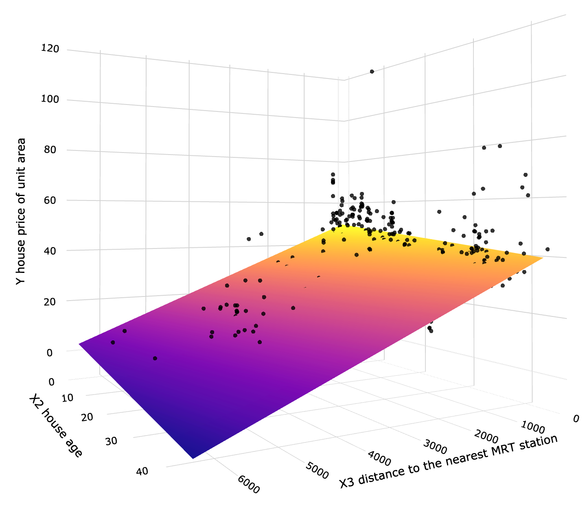
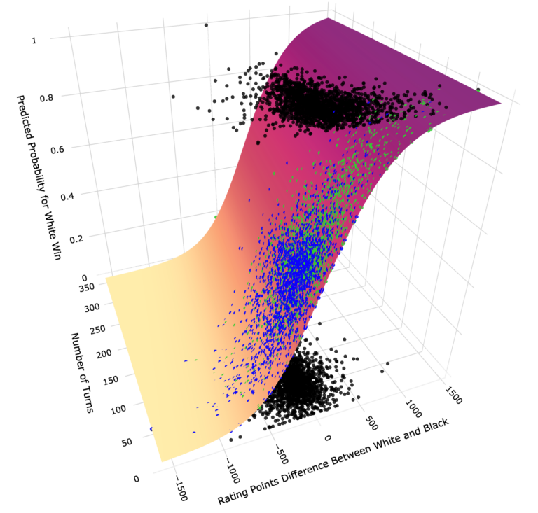
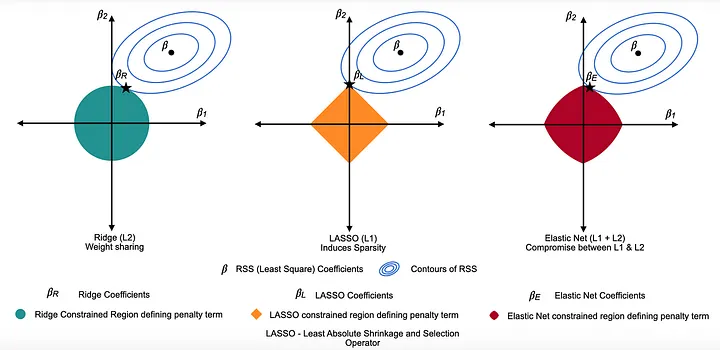

<!-- paginate: skip -->

<h1 class="section-header">Лекція 6</h1>

## Лінійна та логістична регресія

---

# Вступ

<!-- paginate: true -->

Регресія — одна з найстаріших і найважливіших ідей у статистиці та машинному навчанні.
Вона дозволяє формалізувати питання типу: “Як змінюється результат, коли змінюється певний фактор?”

На відміну від більш складних моделей (нейронних мереж, ансамблів),
регресія надає **інтерпретовану залежність**, тобто ми не лише передбачаємо, а й розуміємо, **чому** змінюється результат.

У загальному вигляді:
$$
y = f(X) + \varepsilon,
$$
де $f(X)$ — детермінована частина моделі, а $\varepsilon$ — випадкова похибка.

---

# Лінійна регресія

Лінійна регресія шукає таку гіперплощину в просторі ознак, яка *найкраще наближає дані* у сенсі мінімальної квадратичної помилки.

Іншими словами, вона намагається “протягнути пряму” через хмару точок,
так щоб відстані між реальною точкою та лінією прогнозу були мінімальні у середньому.

---

# Модель

Для даних $(x_i, y_i)$, $i = 1, 2, \ldots, n$,  
модель лінійної регресії визначається як:  
$$
\hat{y}_i = w_0 + w_1 x_{i1} + w_2 x_{i2} + \ldots + w_d x_{id} = X_i w.  
$$

У матричному вигляді:  
$$
\hat{y} = X w,  
$$ 
де  
$X \in \mathbb{R}^{n \times d}$ — матриця ознак,  
$w \in \mathbb{R}^d$ — вектор коефіцієнтів (ваг).

---

# Оцінювання параметрів

Модель мінімізує суму квадратів похибок:
$$
J(w) = \frac{1}{2n} \sum_{i=1}^{n} (y_i - X_i w)^2 = \frac{1}{2n}|y - Xw|^2.
$$

Для аналітичного розв’язку використовують рівняння норм:
$$
w^* = (X^\top X)^{-1} X^\top y.
$$

Це означає, що ми шукаємо вектор $w$, який робить залишки (помилки) ортогональними до простору ознак.

---

# Геометрична інтерпретація

У просторі ознак усі можливі передбачення утворюють підпростір стовпців $X$.
Оптимальне передбачення $Xw^*$ — це **ортогональна проєкція** вектора $y$ на цей підпростір.
Помилка $e = y - Xw^*$ перпендикулярна до всіх ознак:
$$
X^\top e = 0.
$$

Тобто, ми знаходимо лінію (або площину), найближчу до точок у середньоквадратичному сенсі.

---

# Геометрична інтерпретація

---

# Якість моделі: коефіцієнт детермінації

$$
R^2 = 1 - \frac{\sum_i (y_i - \hat{y}_i)^2}{\sum_i (y_i - \bar{y})^2}.
$$

Інтерпретація:
* $R^2 = 1$: модель ідеально пояснює варіацію цілі;
* $R^2 = 0$: модель не краща за просте середнє.
  Якщо $R^2 < 0$, модель гірша за базову.

---

# Проблеми мультиколінеарності

Якщо ознаки сильно корельовані, то оцінки $w$ стають нестабільними: малі зміни в даних можуть сильно змінювати коефіцієнти. Рішенням може бути *регуляризація (Ridge, Lasso)*, яка додає штраф за великі коефіцієнти.

---

# Приклад: прогноз вартості житла

| Ознака            | Коефіцієнт | Інтерпретація                                   |
| ----------------- | ---------- | ----------------------------------------------- |
| Площа            | 10 500        | кожен 1 м² збільшує ціну на ₴10500                |
| Кімнати           | 150 000     | кожна кімната додає ₴150 000                     |
| Відстань від центру | -10 000     | кожен км віддалення зменшує ціну на ₴10 000      |
| Вік             | -8 000       | рік старіння будинку зменшує ціну на ₴8 000 |

Найбільший вплив має площа й кількість кімнат.
Негативний ефект відстані та віку вказує на типову ринкову логіку.

---

# Логістична регресія

Логістична регресія використовується для *класифікації*:
вона передбачає **ймовірність** того, що об’єкт належить до класу 1.

Для будь-якого вхідного вектора $x$:
$$
P(y=1|x) = \frac{1}{1 + e^{-(w_0 + w^\top x)}}.
$$

Ця функція $f(z) = \frac{1}{1+e^{-z}}$ називається *сигмоїдою* —
вона стискає будь-яке реальне число $z$ у діапазон $[0, 1]$.

---

# Геометрична інтерпретація

Логістична регресія будує *гіперплощину* в просторі ознак, яка розділяє два класи (0 і 1).
На відміну від “жорстких” методів (як SVM), тут розділення м’яке: поблизу межі модель дає значення 0.4–0.6, тобто *невпевненість*.

---

# Геометрична інтерпретація

---

# Функція втрат: кросентропія

Для оцінювання параметрів використовують функцію логістичної втрати:
$$
J(w) = -\frac{1}{n} \sum_{i=1}^{n} [y_i \log \hat{y}_i + (1 - y_i) \log(1 - \hat{y}_i)].
$$

Ця функція штрафує модель, якщо вона впевнена у неправильному класі.
Мінімізація $L(w)$ — еквівалентна *максимізації правдоподібності (MLE)*
$$
L(w) = \prod_{i=1}^{n} [\hat{y}_i^{y_i}(1 - \hat{y}_i
)^{1 - y_i}],
$$
$$
J(w) = \operatorname{log}J(w),
$$
$$
\operatorname{arg}\operatorname{max}_wL(w)=\operatorname{arg}\operatorname{max}_wJ(w).
$$

---

# Логіт і відношення шансів

Логіт — це логарифм відношення шансів:
$$
\log\frac{P(y=1|x)}{1 - P(y=1|x)} = w_0 + w^\top x.
$$

Отже, кожен коефіцієнт $w_j$ описує зміну логарифма шансів, а не самої ймовірності.
Це робить модель *лінійною у логітах*, але *нелінійною у ймовірностях*.

---

# Приклад: прогноз відтоку клієнтів

$$
\log\frac{P(\text{churn}=1)}{1-P(\text{churn}=1)} = -3.5 + 0.02 \cdot calls + 1.2 \cdot complaints.
$$

**Інтерпретація:**
* коефіцієнт $1.2$ для $complaints$ означає, що кожна додаткова скарга збільшує шанс відтоку в $e^{1.2} \approx 3.3$ рази;
* 0.02 для $calls$ — слабкий ефект: кожен додатковий дзвінок збільшує шанс на $2\%$.

---

# Приклад: медична діагностика

$$
\log\frac{P(\text{disease}=1)}{1-P(\text{disease}=1)} = -4.8 + 0.07 \cdot age + 1.5 \cdot test_{positive}.
$$

**Інтерпретація:**
* $e^{0.07} \approx 1.07$: кожен рік віку збільшує шанси хвороби на 7%;
* $e^{1.5} \approx 4.48$: позитивний тест збільшує ймовірність у 4,5 рази.

---

<h1 class="section-header">Інтерпретація коефіцієнтів логістичної регресії</h1>

---

#  Log-odds

Логістична модель лінійна в *логарифмах шансів*:
$$
\log\frac{p}{1-p} = w_0 + w_1x_1 + \ldots + w_dx_d.
$$
Це означає, що при збільшенні $x_j$ на 1, логарифм шансів змінюється на $w_j$.

---

# Odds ratio (відношення шансів)

Шанс — це відношення:
$$
\text{odds} = \frac{p}{1-p}.
$$

Коефіцієнт $w_j$ означає, що шанс класу 1 змінюється у $e^{w_j}$ разів при збільшенні $x_j$ на одиницю.

Якщо $w_j = 0.7$, то $e^{0.7} ≈ 2.01$, тобто зміна $x_j$ на 1 подвоює шанс належати до класу 1.

---

# Граничний вплив (marginal effects)

Показує, як змінюється ймовірність при невеликій зміні $x_j$:
$$
\frac{\partial P(y=1|x)}{\partial x_j} = P(y=1|x) \cdot (1 - P(y=1|x)) \cdot w_j.
$$
Це нелінійна функція.
Граничний ефект найбільший при ($P ≈ 0.5$), а майже зникає при крайніх значеннях ($0$ або $1$).

Якщо коефіцієнт великий, але ймовірність близька до $0$ або $1$, зміна ознаки майже не вплине на рішення.

---

# Приклад: відтік клієнтів

$$
\log\frac{p}{1-p} = -2.3 + 1.1 \cdot \text{complaints} + 0.03 \cdot \text{calls}.
$$

| Ознака     | $w_j$ | $e^{w_j}$ | Інтерпретація                                |
| ---------- | ----- | --------- | -------------------------------------------- |
| Complaints | 1.1   | 3.0       | кожна скарга утричі підвищує шанс відтоку    |
| Calls      | 0.03  | 1.03      | кожен додатковий дзвінок збільшує шанс на 3% |

При середній ймовірності $P=0.4$ граничний ефект скарги дорівнює $0.4(1-0.4)×1.1≈0.26$, отже маємо $+26\%$ до ймовірності відтоку.

---

# Висновки

- Лінійна регресія описує лінійні кількісні залежності та є базовим блоком для моделей прогнозування.
- Логістична регресія — фундаментальний інструмент класифікації, що має чітку статистичну основу.
- Інтерпретація через *Odds ratio* та *Marginal effects* робить її особливо корисною у пояснювальних моделях.
- Розуміння цих моделей формує основу для більш складних алгоритмів — нейронних мереж, SVM, ансамблів.

---

<h1 class="section-header">Регуляризовані варіанти регресії (Ridge, Lasso, ElasticNet)</h1>

---

# Вступ

У реальних задачах машинного навчання часто спостерігається перенавчання (overfitting), при якому   модель надто добре підлаштовується під тренувальні дані, але погано узагальнює нові.

Це трапляється, коли:
- кількість ознак велика порівняно з кількістю спостережень;
- ознаки сильно корельовані (мультиколінеарність);
- є шум у даних.

---

# Вступ

Щоб уникнути перенавчання, у функцію втрат додають *штрафний член (penalty)*, який усікає великі коефіцієнти:  
$$
J(w) = L(w) + \lambda \cdot R(w),  
$$ 
де
- $L(w)$ — стандартна функція втрат (MSE або крос-ентропія),  
- $R(w)$ — регуляризаційний терм,
- $\lambda > 0$ — коефіцієнт регуляризації.

Регуляризація *зменшує складність моделі*, контролюючи розмір коефіцієнтів.

---

# Ridge-регресія (L2 Regularization)

У лінійній регресії:  
$$  
J(w) = \frac{1}{2n} |y - Xw|^2 + \lambda |w|_2^2.  
$$

Штраф $|w|_2^2 = \sum_j w_j^2$ — це квадрат норми L2, яка зменшує коефіцієнти, але не робить їх рівними нулю.
Розв’язок Ridge-регресії:  
$$
w^* = (X^\top X + \lambda I)^{-1} X^\top y.  
$$

Порівняно з МНК, додається матриця $\lambda I$, яка стабілізує обернення навіть при мультиколінеарності.

---

# Геометрична інтерпретація

- L2-регуляризація “стискає” параметри до сфери (кулі).   
- Мінімізатор лежить у точці, де еліпсоїди помилок торкаються кулі $|w|_2^2 = c$.
Це зменшує варіацію, але дещо збільшує зміщення у bias–variance tradeoff.

---

# Вплив параметра $λ$

- λ=0: звичайний МНК;
- λ - мале: дещо зменшені коефіцієнти, стабільна модель;
- λ - велике: коефіцієнти → 0, модель спрощується.

Ridge добре працює, коли всі ознаки мають вплив, але корельовані.

---

# Приклад

Модель прогнозу ціни нерухомості:  
$$
J(w) = \frac{1}{2n}\sum (price - Xw)^2 + \lambda \sum w_j^2.  
$$

- Для $\lambda = 0.1$: модель майже не змінюється.  
- Для $\lambda = 10$: коефіцієнти "area", "rooms" зменшуються, а  
модель стає стабільнішою, але менш чутливою до дрібних факторів.

---

# Lasso-регресія (L1 Regularization)

$$ 
J(w) = \frac{1}{2n} |y - Xw|^2 + \lambda |w|_1,  
$$ 
де $|w|_1 = \sum_j |w_j|$.

Lasso “штрафує” великі коефіцієнти сильніше, ніж Ridge, а для деяких $w_j$ — навіть змушує їх ставати рівними нулю.

Тобто Lasso виконує відбір ознак (feature selection) таким чином, що з великої кількості змінних залишаються лише найінформативні.

Мінімізатор помилки потрапляє у вершину ромба (L1-норма), де деякі координати дорівнюють нулю. Це пояснює, чому Lasso відкидає частину ознак.

---

# Вибір λ

- Малий λ → усі коефіцієнти активні.
- Великий λ → залишаються лише ключові ознаки.
Вибір оптимального λ часто роблять через крос-валідацію (GridSearchCV або LassoCV).

Крос-валідація означає, що дані діляться на кілька частин (наприклад, на 5 або 10 "складок (folds)"). Модель тренується на частинах даних і перевіряється на решті. Це дозволяє оцінити її ефективність на різних підмножинах даних і запобігти перенавчанню.

---

# Приклад

При побудові моделі для передбачення оцінки товару за 50 характеристиками  
Lasso наприклад залишає лише 6 найважливіших: delivery time, review score, price, category, is premium.
Це може зробити модель короткою, легко інтерпретованою і швидкою.

---

# ElasticNet як компроміс між Lasso і Ridge

$$ 
J(w) = \frac{1}{2n}|y - Xw|^2 + \lambda_1 |w|_1 + \lambda_2 |w|_2^2.  
$$

Або у зведеній формі:  
$$ 
J(w) = \frac{1}{2n}|y - Xw|^2 + \lambda \big[(1-\alpha)|w|_2^2/2 + \alpha |w|_1\big].  
$$

---

# ElasticNet

Інтерпретація параметра $\alpha$

- $0$ - Ridge.
- $1$ - Lasso.
- $0.5$ - Збалансована регуляризація.

ElasticNet особливо корисний, коли ознак багато, є сильні кореляції між змінними чи хочеться зберегти стабільність Ridge і відбір ознак Lasso.
Область регуляризації — округлений ромб: він зберігає властивість обнулення частини коефіцієнтів (як Lasso),  
але не настільки агресивно, завдяки L2-компоненті.

---

---

# Приклад

У задачі прогнозу відтоку клієнтів ElasticNet при α=0.6   залишає 12 із 30 ознак активними, але їхні значення стабільніші, ніж при Lasso, що покращує узагальнення на тестових даних.

---

# Регуляризація у логістичній регресії

Регуляризація використовується і для класифікації, де функцією втрат є крос-ентропія.

$$
J(w) = -\frac{1}{n} \sum_i [y_i \log \hat{y}_i + (1 - y_i)\log(1 - \hat{y}_i)] + \lambda |w|_p.  
$$

- при $p=2$ маємо Ridge логістична регресія  
- при $p=1$ маємо Lasso логістична регресія
- інакше ElasticNet логістична регресія

Регуляризація контролює “розтягування” сигмоїди та запобігає надмірній впевненості моделі.

---

# Висновки

Регуляризація важлива концепція сучасного машинного навчання, яка забезпечує *баланс між точністю та узагальненням*.
- Ridge стабілізує модель, Lasso відбирає ознаки, ElasticNet — оптимально комбінує.
- У логістичній регресії регуляризація допомагає запобігати надмірній впевненості у передбаченнях.
