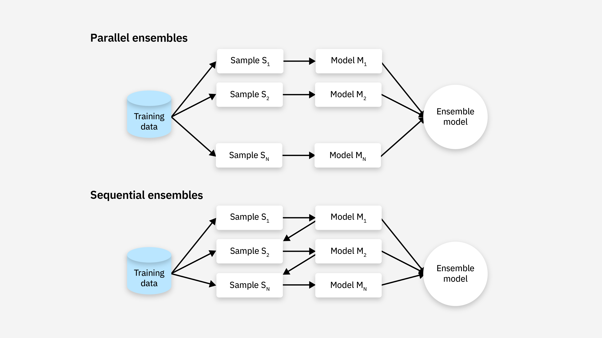
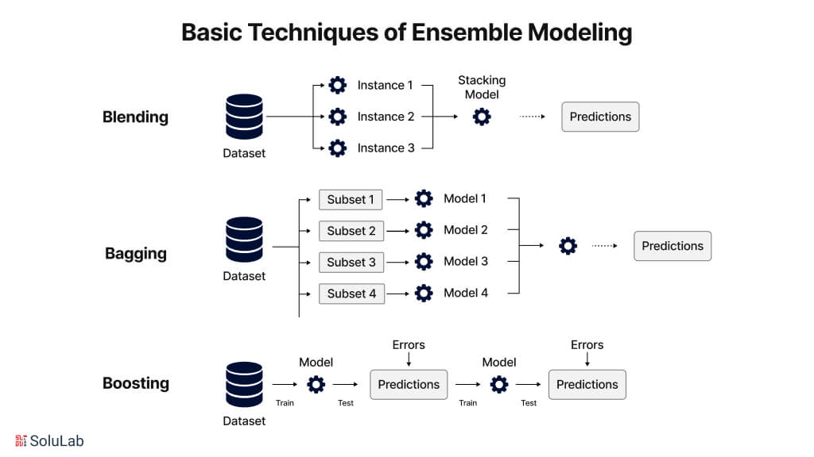
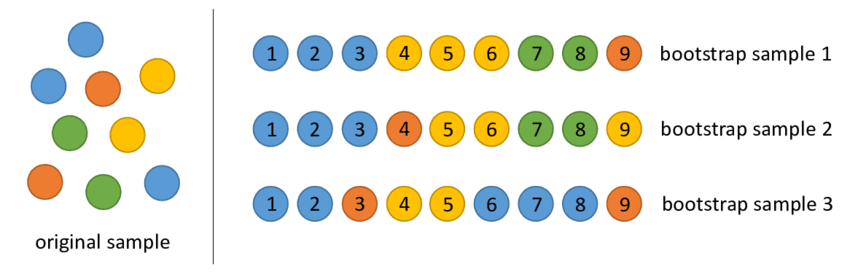
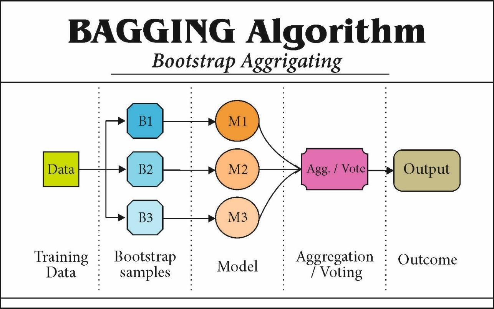
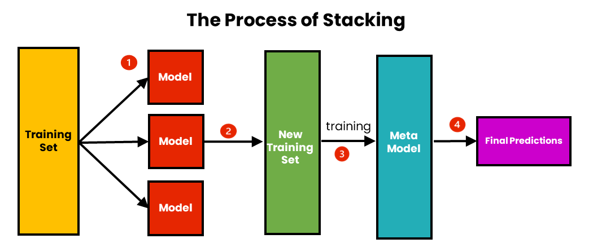

<!-- paginate: skip -->

<h1 class="section-header">Лекція 7</h1>

## Ансамблеві методи

---

# Ансамблеві методи

<!-- paginate: true -->

Ансамблеві методи — це підхід в машинному навчанні, де комбінуються кілька моделей (базових моделей, або "weak learners") для створення потужнішої моделі з більшою точністю. Основна ідея полягає в тому, що кілька моделей, які помиляються по-різному, можуть разом працювати краще, ніж окрема модель.

---

---

# Bagging (Bootstrap Aggregating):

- Створення кількох моделей на різних випадкових підмножинах даних.
- Моделі працюють незалежно одна від одної.
- Результат отримується шляхом агрегації (середнє, голосування) результатів окремих моделей.

Нехай $\hat{y_1}, \hat{y_2}, \dots, \hat{y_k}$ — прогнози базових моделей.
Для класифікації:
$$
  \hat{y} = \text{mode}(\hat{y_1}, \hat{y_2}, \dots, \hat{y_n})
$$
Для регресії:
$$
   \hat{y} = \frac{1}{n} \sum_{i=1}^{n} \hat{y_i}
$$

---

# Boosting

- Побудова моделі на основі попередніх з корекцією помилок.
- Моделі не працюють незалежно, кожен наступний класифікатор намагається виправити помилки попереднього.

$$
  F_m(x) = F_{m-1}(x) + \eta \cdot h_m(x)
$$
де $F_{m-1}(x)$ — попередня модель, $h_m(x)$ — нова модель, що виправляє помилки, а $\eta$ — швидкість навчання.

---

# Stacking (Stacked Generalization):

Кілька моделей комбінуються в один ансамбль, а потім результат обробляється ще однією моделлю (мета-моделлю).

Нехай $\hat{y_1}, \hat{y_2}, \dots, \hat{y_k}$ — прогнози базових моделей. Мета-модель використовує їх як вхід:
$$
  \hat{y} = f(\hat{y_1}, \hat{y_2}, \dots, \hat{y_k})
$$
де $f$ — мета-модель, яка може бути, наприклад, лінійною регресією.

---

---

# Bagging

Bagging полягає в тому, що кожен базовий класифікатор чи регресор тренується на випадковій підвибірці з даних, отриманих через *bootstrap sampling* (вибірка з повтореннями). Після цього результати кожної моделі комбінуються.

---

# Bootstrap Sampling

Bootstrap sampling — це статистична техніка для оцінки властивостей вибірки або побудови моделей на основі повторних вибірок з даних. Вона використовується в багатьох методах машинного навчання, зокрема в ансамблевих методах, таких як Random Forest. Основна ідея полягає в тому, щоб створити декілька підвибірок з оригінальної вибірки, кожна з яких може мати повторення елементів, і використовувати ці підвибірки для тренування моделі або оцінки її ефективності.

---

# Bootstrap Sampling

Основна ідея полягає в тому, щоб взяти багато випадкових вибірок з оригінальної вибірки з поверненням. Кожна така вибірка має розмір, рівний розміру початкової вибірки, але елементи можуть повторюватися. Ці підвибірки потім використовуються для тренування моделей або для оцінки варіативності деяких статистичних показників.

--- 

# Алгоритм

- Вибірка з поверненням. Вибирається випадкові елементи з початкової вибірки (наприклад, з $N$ елементів). При виборі елемента дозволено повторення — тобто, один і той самий елемент може бути вибраний кілька разів.
- Повторення. Процес вибірки з поверненням повторюється кілька разів (наприклад, $N$ разів), щоб створити багато різних підвибірок.
- Використання підвибірок. Кожна підвибірка може бути використана для тренування моделі, оцінки статистичних характеристик або для побудови ансамблів.

---

# Приклад

Нехай є набір даних з 5 точок: $[ {1, 2, 3, 4, 5} ]$
Якщо робиться вибірка з поверненням розміру $5$, то можна отримати, наприклад: $[ {1, 2, 2, 4, 5} ]$
Зробивши кілька таких вибірок, ми отримуємо кілька різних підвибірок, які потім можна використовувати для подальших аналізів або тренувань.

---

# Оцінка точності моделей (Bootstrap для оцінки похибки)

Bootstrap часто використовується для оцінки варіативності моделей та для визначення точності на нових даних. Наприклад, ми можемо побудувати кілька моделей на різних підвибірках і обчислити середню похибку на нових даних (out-of-bag, OOB).

---

# Оцінка довірчих інтервалів

Один з основних застосунків Bootstrap в статистиці — це побудова довірчих інтервалів для оцінок. Завдяки тому, що ми генеруємо багато різних підвибірок, ми можемо оцінити розподіл статистичних показників (середнє, медіану, стандартне відхилення) і створити довірчий інтервал.

---

# Використання в ансамблевих методах

Bootstrap — це основа для Random Forest. У Random Forest кожне дерево будується на окремій підвибірці з оригінального набору даних, отриманій за допомогою Bootstrap. Це дозволяє деревам бути незалежними, що знижує кореляцію між ними і покращує точність ансамблю.

---

# Висновки

- Метод можна використовувати в різних контекстах, не обмежуючись лише певними типами моделей чи завдань.
- З допомогою Bootstrap можна оцінити несприятливість та варіативність моделей, навіть якщо є невелика кількість даних.
- У методах ансамблів (наприклад, Random Forest) можна створити незалежні моделі, що покращує їхню загальну ефективність.
- Оскільки деякі дані можуть бути пропущені в кожній підвибірці, це може призвести до втрати деякої інформації.
- Якщо генерується багато підвибірок і тренуєте на них моделі, це може бути дуже обчислювально важким процесом.

---

---

# Алгоритм Bagging

- Вибираємо випадкову підмножину даних (з повтореннями) для кожної базової моделі.
- Навчаємо кожну модель на своїй підвибірці.
- Для класифікації:
  - Вибираємо клас, який набирає більшість голосів від усіх моделей (метод голосування).
  - Для регресії — обчислюємо середнє значення результатів усіх моделей.
- Повертаємо результат.

Такий підхід добре працює з нестабільними моделями, такими як дерева рішень (наприклад, Random Forest).

---

---

# Агрегація

Агрегація — це метод об'єднання прогнозів кількох моделей в одне фінальне рішення, зазвичай через обчислення середнього значення або подібних статистичних операцій. Цей метод зазвичай використовується для регресії, де потрібно обчислити середнє значення результатів усіх базових моделей.

---

# Агрегація

- Кожна базова модель (наприклад, дерево рішень, лінійна регресія тощо) дає своє передбачення.
- Результати цих моделей об'єднуються за допомогою математичної агрегації: *середнє значення*, *медіану* або *сумування*.

Якщо є набір прогнозів $\hat{y}_1, \hat{y}_2, \dots, \hat{y}_T$ від $T$ базових моделей, то фінальний прогноз для регресії можна обчислити як середнє значення:

$$
\hat{y} = \frac{1}{T} \sum_{i=1}^{T} \hat{y}_i
$$

---

# Агрегація

Середнє значення може знизити вплив шуму та аномальних значень, оскільки "вирівнює" передбачення. Агрегація допомагає знизити варіативність результатів, коли окремі моделі дають дуже різні прогнози.
Якщо одна з моделей дає значно поганий прогноз, середнє може сильно погіршити точність.

---

# Голосування (Voting)

Голосування — це метод, який зазвичай використовується для задач класифікації. Суть цього методу полягає в тому, що кожна модель "голосує" за один з можливих класів, а клас з найбільшою кількістю голосів обирається як фінальний прогноз.

---

# Мажоритарне голосування (Hard Voting)

- Кожна модель передбачає один з класів.
- Фінальний клас визначається за більшістю голосів — той клас, який отримав найбільшу кількість голосів, стає передбаченням ансамблю.
Якщо маємо $T$ моделей і кожна з них дає прогноз класу $y_i$, то фінальний прогноз $y$ буде:
$$
  y = \text{mode}(y_1, y_2, \dots, y_T),
$$
де $mode$ — це значення, яке зустрічається найчастіше.
Наприклад якщо 5 моделей дали класи "A", "A", "B", "B", "A", то фінальний клас буде "A" (майоритарне голосування).

---

# Голосування за ймовірністю (Soft Voting)

- Кожна модель дає ймовірності для кожного класу (наприклад, класифікатор може оцінити ймовірність того, що об'єкт належить до кожного з можливих класів).
- Фінальний прогноз визначається як клас з найвищою середньою ймовірністю.
Якщо кожна модель дає ймовірність для кожного класу, скажімо $p_{1}, p_{2}, \dots, p_{T}$ для класу $C_k$, то загальна ймовірність для класу $C_k$ буде середнім значенням ймовірностей від усіх моделей:
$$
  P(C_k) = \frac{1}{T} \sum_{i=1}^{T} P(C_k | \text{Model}_i)
$$
де $P(C_k | \text{Model}_i)$ — ймовірність того, що модель $i$ передбачить клас $C_k$.

---

# Голосування за ймовірністю

Наприклад якщо для двох класів $A$ та $B$ для моделі $1$ ймовірності складають $0.8$ для $A$ і $0.2$ для $B$, а для моделі $2$ ці ймовірності $0.6$ для $A$ і $0.4$ для $B$, то для класу ( A ) загальна ймовірність буде:
$$
  P(A) = \frac{0.8 + 0.6}{2} = 0.7
$$
а для класу $B$:
$$
  P(B) = \frac{0.2 + 0.4}{2} = 0.3
$$
Таким чином, фінальний прогноз буде клас $A$.

---

# Зважене голосування (Weighted Voting)

Цей метод є варіацією стандартного голосування в якому кожна модель отримує різну вагу, яка визначає її важливість у фінальному рішенні. Замість того щоб кожна модель мала рівну вагу, її вплив на результат може бути пропорційним її точності або іншій метриці.

---

# Зважене голосування

- Кожній моделі приписується певна вага $w_i$, яка зазвичай обчислюється на основі її точності або ефективності.
- Фінальний прогноз отримується через взважене голосування, тобто кожна модель "голосує" за клас з врахуванням своєї ваги.

---

# Зважене голосування

Якщо наявний набір прогнозів від $T$ моделей, де кожна модель має вагу $w_i$, то фінальний клас визначається таким чином:

$$
y = \text{argmax}*k \sum*{i=1}^{T} w_i \cdot I(y_i = k),
$$
де:
* $y_i$ — прогноз класу $i$-ї моделі,
* $I(y_i = k)$ — індикатор (0 або 1), який вказує, чи передбачила модель $i$-й клас $k$,
* $w_i$ — вага $i$-ї моделі.

---

# Зважене голосування

Залежно від ваги моделей, слабші прогнози мають менший вплив на фінальне рішення, що дає змогу ефективно комбінувати моделі з різними рівнями точності.

Потрібно правильно обчислювати ваги для моделей, а якщо моделі не мають явної різниці в точності, це може не дати істотного покращення.

---

# Голосування через бінарне дерево голосів (Tree-based Voting)

Цей метод використовує дерево рішень або інші деревовидні структури для об'єднання прогнозів від різних моделей. Заміняючи традиційне голосування, деревоподібні методи можуть створювати більш складні правила для прийняття рішення на основі різних характеристик виведення моделей.

---

# Голосування через бінарне дерево голосів

- Створюється дерево рішень, яке приймає прогнози моделей як вхідні ознаки. Це дерево навчено приймати рішення на основі їх комбінацій.
- Прогнози кожної моделі стають ознаками в дереві, а фінальний клас вибирається за допомогою структури дерева.

Метод дозволяє ефективно комбінувати різні типи моделей, враховуючи їх взаємодії. Він може поліпшити точність за рахунок складних правил прийняття рішень, порівняно з простим голосуванням.
Метод вимагає побудови додаткового дерева, що може збільшити складність і час обчислень і може бути схильним до перенавчання, якщо не застосовувати правильні стратегії для налаштування дерева.

---

# Голосування з урахуванням впевненості (Confidence Voting)

Цей метод є варіацією soft voting, але з додатковою ваговою системою, яка оцінює, наскільки впевнена модель у своєму прогнозі. Якщо модель має високу впевненість в своєму прогнозі (наприклад, висока ймовірність для певного класу), її голос може мати більшу вагу.

---

# Голосування з урахуванням впевненості

- Для кожної моделі обчислюється її *впевненість* (наприклад, ймовірність прогнозу для класу).
- Моделі з високою впевненістю у своєму прогнозі отримують більшу вагу в голосуванні, ніж ті, що дають менш точні або суперечливі результати.

Фінальний клас визначається за такою формулою:

$$
y = \text{argmax}*k \sum*{i=1}^{T} P_i(y_k) \cdot I(y_i = y_k),
$$
де $P_i(y_k)$ — ймовірність для класу $y_k$, яку дає $i$-та модель.

---

# Голосування з урахуванням впевненості

У цьому випадку моделі, які більш впевнені у своєму прогнозі, можуть мати більший вплив, що може покращити точність. Дозволяє уникнутм ситуації, коли не впевнені моделі впливають на рішення.
Потрібно правильно оцінювати впевненість кожної моделі, що може бути складно для деяких типів класифікаторів і може бути неефективним у випадку, коли всі моделі дають однакову або малу впевненість.

Наприклад якщо модель дає ймовірність класу $A$ як $0.9$, а інша модель дає ймовірність $B$ як $0.6$, то впевненість моделі з ймовірністю $0.9$ дасть більший вплив на фінальний прогноз.

---

# Голосування через середньозважену ймовірність (Weighted Probability Voting)

Цей метод є подібним до голосування за ймовірностями, але з додатковим кроком: моделі важать не тільки свої прогнози, а й ймовірності для кожного класу.

- Для кожного класу кожна модель дає ймовірність.
- Ці ймовірності зважуються відповідно до точності або іншої метрики моделі, що дозволяє сильнішим моделям мати більший вплив на результат.

---

# Голосування через середньозважену ймовірність

Для кожного класу $C_k$, загальна ймовірність буде:

$$
P(C_k) = \frac{\sum_{i=1}^{T} w_i \cdot P(C_k | \text{Model}*i)}{\sum*{i=1}^{T} w_i}
$$

де $w_i$ — вага моделі $i$, а $P(C_k | \text{Model}_i)$ — ймовірність того, що модель $i$ передбачить клас $C_k$ .

Такий підхід дозволяє комбінувати прогнози за допомогою вагових коефіцієнтів і ймовірностей, що може покращити точність. Моделі з більш високою точністю або впевненістю мають більший вплив.
Однак потрібно надійно обчислювати ваги моделей, що може бути складно, якщо точність змінюється від однієї моделі до іншої.

---

# Висновки

Голосування дає стабільність в сенсі, що навіть якщо одна з моделей робить помилку, інші можуть компенсувати її. Воно може працювати з різними типами моделей: можна комбінувати різні типи моделей (наприклад, дерева рішень, логістичну регресію, SVM).

Проте часто голосування може бути занадто залежним від слабких моделей, тобто якщо більшість моделей дають дуже схожі, але неправильні прогнози, голосування не дасть корисного результату.

---

# Boosting

Boosting є процесом побудови моделі, де кожен новий класифікатор вчиться на помилках попередніх. В результаті моделі, що правильно класифікують складні приклади, набирають більше ваги. Це означає, що boosting послідовно намагається виправити помилки попередніх моделей, фокусуючи увагу на тих прикладах, де була найбільша похибка.

---

# Алгоритм

- Перший класифікатор навчається на всіх даних.
- Другий класифікатор намагається виправити помилки першого, приділяючи більше уваги тим прикладам, де перший класифікатор помилився.
- Кожен наступний класифікатор виправляє помилки попередніх.
- Моделі комбінуються за допомогою ваги — моделі, що зробили менше помилок, мають більшу вагу.

#### Оновлення в Boosting (на прикладі AdaBoost):
$$
F_m(x) = F_{m-1}(x) + \eta \cdot h_m(x)
$$
де $F_{m-1}(x)$ — попередня модель, $h_m(x)$ — нова модель, що виправляє помилки, а $\eta$ — коефіцієнт навчання.

---

--- 

# Типи Boosting

- AdaBoost (Adaptive Boosting) — адаптує ваги прикладів, щоб фокусуватися на тих, що класифіковані неправильно.
- Gradient Boosting — використовує градієнтний спуск для мінімізації функції втрат на кожному кроці.
- XGBoost, LightGBM, CatBoost — оптимізовані реалізації Gradient Boosting, які здебільшого використовуються в задачах табличних даних завдяки своїй високій швидкодії та точності.

---

# Висновок

Bootsting дає підвищену точність завдяки фокусуванню на складних прикладах і є підхожим для задач, де є багато слабких моделей, які разом можуть дати сильний результат.

---

# Stacking (Stacked Generalization)

Stacking є більш складним методом, ніж Bagging та Boosting. В цьому випадку кілька базових моделей (наприклад, дерева рішень, лінійні моделі, нейронні мережі) комбінуються для створення ансамблю. Прогнози цих моделей використовуються як вхід для мета-моделі, яка навчиться робити остаточний прогноз.

#### Алгоритм Stacking:
- Навчаємо кілька різних базових моделей на одному й тому ж наборі даних.
- Створюємо новий набір даних, в якому кожен приклад — це прогноз, зроблений базовими моделями.
- Навчаємо мета-модель на цих прогнозах для створення остаточного передбачення.

---

# Stacking

Нехай $\hat{y_1}, \hat{y_2}, \dots, \hat{y_k}$ — прогнози базових моделей. Мета-модель використовує їх як вхід:
$$
\hat{y} = f(\hat{y_1}, \hat{y_2}, \dots, \hat{y_k})
$$
де $f$ — мета-модель, яка може бути, наприклад, лінійною регресією.

---

---

# Метамодель

Метамодель займає важливу роль у методі Stacking, оскільки вона визначає, як поєднувати прогнози різних моделей. Це дає можливість отримати кращі результати, ніж у кожної з окремих моделей, шляхом поглинання корисної інформації з кожної моделі та мінімізації їхніх слабких місць.

Якщо одна з моделей дає погані прогнози в певних випадках, метамодель може компенсувати це, взявши до уваги прогнози інших моделей.

Якщо базові моделі мають сильні сторони в різних частинах простору ознак, метамодель може "об'єднати" їх таким чином, щоб отримати кращий результат.

---

# Тренування метамоделі

Метамодель в stacking працює на передбаченнях базових моделей, тобто вона вчиться робити передбачення на основі того, як базові моделі оцінюють кожен приклад. Тому для тренування метамоделі потрібно:
- Для кожного прикладу з тренувальної вибірки отримати передбачення від кожної з базових моделей.
- Використовувати ці передбачення як нові ознаки (features) для метамоделі.

---

# Вибір даних для тренування метамоделі

Для тренування метамоделі потрібно подбати, щоб вона не "бачила" тестових даних або не отримувала від них пряму інформацію (щоб уникнути leakage). Ось як це можна реалізувати:
Якщо базові моделі тренуються на всіх даних без належного контролю, метамодель може побачити інформацію про тестові дані під час тренування. Це може призвести до leakage — коли метамодель отримує знання, яких не повинна була б мати під час тестування.

---

# Вибір даних для тренування метамоделі

Щоб цього уникнути, зазвичай використовують крос-валідацію для тренування базових моделей, а також для побудови даних для метамоделі:
- Розбиваємо тренувальний набір даних на кілька частин (наприклад, 5 або 10 фолдів).
- Кожну базову модель тренуємо на всіх даних, окрім поточного фолду (тобто, на кожному фолді використовуємо різну частину даних для тестування).
- Отримуємо передбачення для поточного фолду від кожної базової моделі.
- Повторюємо це для кожного фолду і об'єднуємо всі прогнози. У результаті для кожного прикладу в тренувальній вибірці ми отримуємо передбачення базових моделей, які можна використовувати для тренування метамоделі.

---

# "Метадані" для метамоделі

Для кожного тренувального прикладу потрібно зібрати передбачення від усіх базових моделей. Таким чином, метадані для метамоделі — це новий набір ознак, що складаються з прогнозів базових моделей:
- Якщо є 3 базові моделі, і кожна з них робить прогноз на 1000 тренувальних прикладів, то на виході отримаємо таблицю з розмірами 1000x3. Кожен стовпець цієї таблиці — це прогноз однієї з базових моделей для кожного тренувального прикладу.

Метамодель буде навчатися на цих нових ознаках (прогнозах), а не на оригінальних вхідних даних.

---

# Висновки

Завдяки комбінації різних моделей, Stacking допомагає знизити ймовірність перенавчання. Кожна з базових моделей може схильна до певних помилок, але комбінуючи їх прогнози, можна покращити загальний результат.
Stacking дозволяє комбінувати моделі з різними підходами (наприклад, дерева рішень, лінійні моделі, нейронні мережі), що дозволяє використовувати переваги кожної з них.

Побудова кількох моделей і метамоделі може бути обчислювально важким процесом, особливо при великих обсягах даних. Для тренування метамоделі часто потрібно здійснювати додаткове розбиття даних, що може призвести до втрати інформації або до недостатнього тренування моделей.
