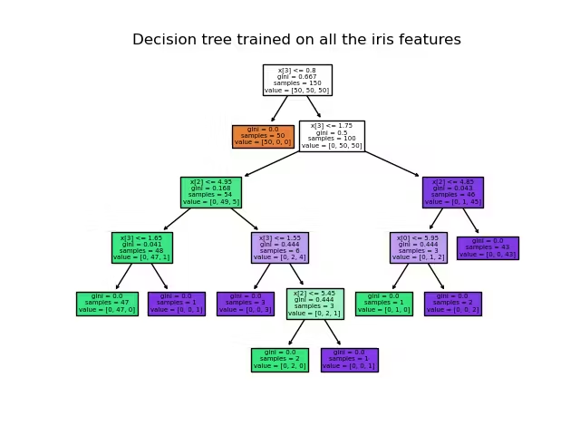
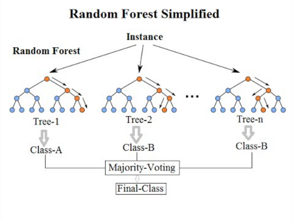
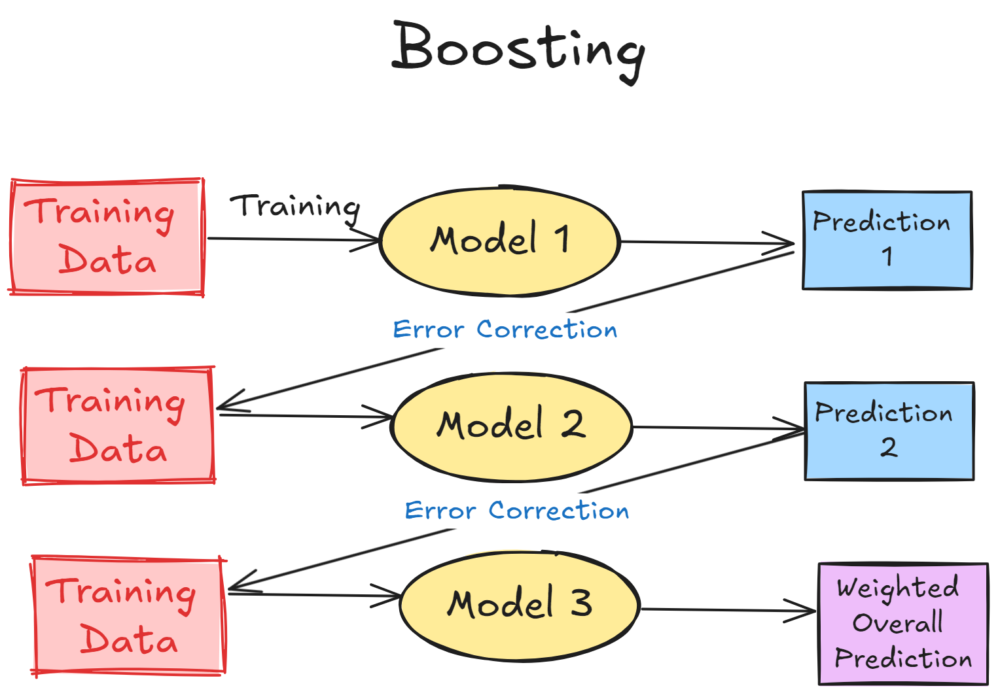
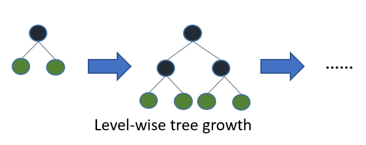
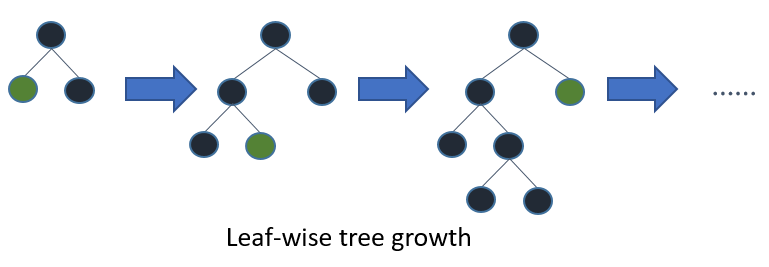
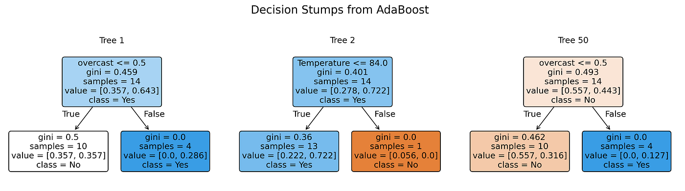

<!-- paginate: skip -->

<h1 class="section-header">Лекція 8</h1>

## Дерева рішень, Random Forest і Gradient Boosting

---

# Дерева рішень

<!-- paginate: true -->

Дерево рішень — це рекурсивний алгоритм, який будує ієрархічну структуру логічних правил, що розділяють простір ознак на частини з максимально однорідними відповідями (класи чи значення у випадку регресії).

З теоретичної точки зору, дерево рішень можна інтерпретувати як *інформаційно-теоретичну оптимізацію*. Вибір кожного розбиття заснований на максимальному зменшенні невизначеності або ентропії.

---

# Дерева рішень

Кожне розбиття вибирається так, щоб:

- **Зменшити ентропію (невизначеність)** — дерево намагається зменшити невизначеність у кожному вузлі. Це є спробою поділу даних на частини, де кожна частина є більш "чистою" за інші.
    
- **Збільшити визначеність результату** — кожен поділ робить прогнози точнішими.
    
- **Мінімізувати змішування різних класів** або **зменшити дисперсію в регресії** — дерево прагне створити вузли, де всі приклади мають однаковий клас (класовий розподіл) або схожі значення (для регресії).

---

# Дерева як нелінійна модель

Лінійні моделі мають форму:
$$
\hat{y} = w_0 + w_1 x_1 + w_2 x_2 + \dots  
$$

У той час як дерево рішень формує *кусково-постійну* функцію:
$$
\hat{y} =  
\begin{cases}  
c_1, & \text{якщо } x_1 < t_1 \text{ і } x_3 > t_2 \\  
c_2, & \text{якщо } x_1 \ge t_1 \text{ і } x_5 < t_3 \ \\
\vdots & \vdots  
\end{cases}  
$$

---

# Дерева як нелінійна модель

Вищенаведена структура дозволяє:
- Моделювати різкі зміни поведінки.  
- Розмежовувати простір ознак на поліедри (гіперпрямокутники), де кожна частина має постійну відповідь.
- Автоматично виявляти взаємодії між ознаками (наприклад, клієнти, які витрачають багато, але роблять рідко покупки, рідше повертають товар).

Це робить дерева рішень дуже підхожими для задач, де є складні нелінійні зв’язки між ознаками.

---

---

# Gini impurity

Міра Gini (чи Gini impurity) вимірює "хаос" чи різноманітність класів у вузлі дерева.

$$
G = 1 - \sum_{k=1}^K p_k^2  
$$

- Якщо вузол чистий (усі приклади одного класу), то ( G = 0 ).
- Якщо два класи рівні (50/50), то ($G = 0.5$).
- Якщо три класи рівні (1/3, 1/3, 1/3), то ($G \approx 0.67$).
    
Чим менший показник Gini, тим "чистіший" вузол.

---

# Ентропія як міра інформації

Міра ентропії:

$$  
H = -\sum p_k \log_2 p_k  
$$

Це кількість інформації, необхідної для кодування класу. Чим більший хаос, тим більше бітів потрібно для кодування результату.
- Якщо вузол "чистий", то ентропія буде мінімальна.
- Якщо класи рівні (100% невизначеність), ентропія максимальна.

Gini зазвичай працює швидше, тому вона частіше використовується в бібліотеках типу sklearn.
    
---

# Інформаційний виграш

На кожному кроці дерево рішень вибирає розбиття, яке:
- Максимально зменшує невизначеність.
- Створює найбільш однорідні дочірні вузли.
- Дає найбільший приріст впорядкування даних.
    
У термінах теорії інформації Шеннона дерево шукає таке питання, відповідь на яке дає найбільше знань про цільову змінну $y$.

---

# Перенавчання дерев

Дерева можуть легко перенавчатися через свою здатність:
- Запам'ятовувати окремі точки.
- Створювати вузли, де є тільки один приклад.
- Усувати шум і створювати надмірно складні моделі.
Це часто відбувається тому, що дерево без належної регуляризації намагається мінімізувати похибку на кожному етапі, навіть за рахунок створення вузлів, які не узагальнюють закономірності. Якщо, наприклад, дерево занадто глибоке, воно може перетворити вибірку на каталог винятків.

---

---

# Випадковість у Random Forest

У класичних деревах рішень найкраща ознака для першого розбиття може повторюватися на всіх деревах, що призводить до високої кореляції між деревами, і вони часто роблять однакові помилки. Це знижує варіативність і стабільність моделі.

Random Forest вирішує цю проблему через два основні джерела випадковості:
- Випадкові підвибірки (bootstrap samples) — для кожного дерева вибирається випадкова підвибірка з оригінальних даних.
- Випадкові ознаки для розбиття — на кожному кроці вибираються випадкові підмножини ознак для того, щоб обирати найкращу ознаку для поділу.
    
Це принцип декореляції моделей, подібний до ідеї "розподілу інвестицій". Зменшення кореляції між моделями підвищує стабільність і точність ансамблю.

---

# Кореляція у Random Forest

Якщо моделі сильно корельовані:  
$$  
Var(\overline{f}) \approx Var(f)  
$$

Якщо моделі незалежні:  
$$  
Var(\overline{f}) = \frac{1}{T} Var(f)  
$$

Random Forest не створює повністю незалежні моделі, але *зменшує кореляцію* між ними. Це призводить до зниження *variance* (варіативності) і лише незначного збільшення *bias* (упередженості), що покращує точність.

---

# Важливість ознак

- **Impurity-based importance**. Цей підхід оцінює важливість ознак через зменшення ентропії чи Gini impurity при кожному розбитті. Це дозволяє оцінити як кожна ознака впливає на чистоту вузлів. Однак, ознаки з великою кількістю можливих порогів (наприклад, числові змінні) можуть бути переоцінені, оскільки вони мають більше можливостей для створення поділів.

- **Permutation Importance**. Метод, який вимірює важливість ознаки, перемішуючи значення цієї ознаки в тестовому наборі і вимірюючи падіння якості моделі. Тут якщо перетасування *ознаки майже не впливає на точність моделі*, то ознака неважлива, а якщо якість різко падає $-$ ознака важлива.
    Цей метод є більш надійним, оскільки він не залежить від безпосередньої структури дерева, а оцінює важливість через практичний вплив на результат.

---

# Приклад

Наприклад при аналізі затримок рейсів Random Forest може виявити важливі ознаки для прогнозування затримок авіарейсів, наприклад:
- `carrier_delay` (затримка авіакомпанії),
- `weather_delay` (погодні затримки),
- `departure_hour` (час відправлення),
- `airport_code` (код аеропорту).

Інтерпретація:
- Авіалінії сильно відрізняються за якістю обслуговування.
- Погода — важливий нелінійний фактор, який сильно впливає на затримки.
- Час доби тісно пов’язаний з навантаженням і іншими чинниками, що можуть спричиняти затримки.

---

# Gradient Boosting

Boosting оптимізує функцію втрат, оновлюючи модель в напрямку негативного градієнта функції втрат:

$$  
L = \sum_{i} L(y_i, F(x_i))  
$$

Похідна (градієнт):  
$$  
r_{im} = -\frac{\partial L}{\partial F(x_i)}  
$$

На кожному кроці дерево, натреноване на помилках попередньої моделі (які є аналогами градієнта), дає корекцію, і вся модель оновлюється:

$$  
F_m = F_{m-1} + \eta h_m  
$$

Цис boosting є схожим на градієнтний спуск у функціональному просторі, де на кожному кроці ми рухаємося в напрямку найбільшої знижки функції втрат.

---

# Алгоритим boosting

Boosting працює таким чином:
- Перша модель робить грубе передбачення.
- Наступна модель намагається виправити помилки попередньої.
- Третя модель виправляє помилки перших двох.
- І так далі...

---

---

# Дерева в boosting

Дерева в *Gradient Boosting Machines (GBM)* зазвичай є малими (глибина 3–8 рівнів). Вони не намагаються моделювати всю поведінку даних, а тільки *локальні корекції*, які дозволяють моделі швидко адаптуватися.

Це дає:
- Високу здатність моделювати складні функції.
- Контроль над переобученням через швидкість навчання (learning rate).

---

# XGBoost

XGBoost (Extreme Gradient Boosting) — це одна з найбільш популярних бібліотек для побудови моделей машинного навчання на основі градієнтного бустингу. Це надзвичайно потужний інструмент, який часто використовується у змаганнях на платформах типу Kaggle.

Цільова функція XGBoost виглядає так:

$$  
Obj = \sum_i L(y_i, F(x_i)) + \sum_m \left(\gamma T_m + \frac{1}{2}\lambda \sum_j w_{mj}^2\right)  
$$

---

# XGBoost інетпритація компонент

- $L(y_i, F(x_i))$ — це стандартна функція втрат (наприклад, середньоквадратична помилка або log-loss), яка вимірює різницю між прогнозом моделі $F(x_i)$ та справжнім значенням $y_i$. 
- $\gamma T_m$ — штраф за кількість листів у дереві. Збільшення числа листів може призвести до перенавчання, тому додавання штрафу дозволяє обмежити складність дерева.
- $\frac{1}{2}\lambda \sum_j w_{mj}^2$ — L2 регуляризація для ваг кожного дерева, що допомагає зменшити варіативність моделей і стабілізує їх.

---

# XGBoost алгоритм

XGBoost мінімізує *регуляризовану функцію втрат*:
$$
\mathcal{L} = \sum_{i=1}^{N} L(y_i, \hat{y}*i^{(t)}) + \sum*{k=1}^{t} \Omega(F_k)
$$
де:
$$
\Omega(F) = \gamma T + \frac{1}{2}\lambda \sum_{j=1}^{T} w_j^2
$$
- $T$ — число листків дерева
- $w_j$ — вага листка
- $\gamma$, $\lambda$ — параметри регуляризації

---

# XGBoost алгоритм

**Розклад втрат у другому порядку**. Використовується квадратичне наближення функції втрат навколо поточного прогнозу:

$$
\mathcal{L}^{(t)} \approx \sum_{i=1}^{N} \big[ g_i F_t(x_i) + \tfrac{1}{2} h_i F_t(x_i)^2 \big] + \Omega(F_t)
$$
де:
- $g_i = \frac{\partial l}{\partial \hat{y}_i}$ — градієнт
- $h_i = \frac{\partial^2 l}{\partial \hat{y}_i^2}$ — гессіан

**Оптимальна вага листка**
$$
w_j^{*} = -\frac{\sum_{i \in I_j} g_i}{\sum_{i \in I_j} h_i + \lambda}
$$

---

# XGBoost алгоритм

**Приріст (gain) при розбитті вузла**
$$
\text{Gain} = \frac{1}{2}\left(
\frac{G_L^2}{H_L+\lambda} +
\frac{G_R^2}{H_R+\lambda} -
\frac{(G_L+G_R)^2}{H_L+H_R+\lambda}
\right) - \gamma
$$
Розбиття приймається, якщо $Gain > 0$.
**Фінальний прогноз**
$$
\hat{y}^{(t)} = \hat{y}^{(t-1)} + \eta , f_t(x)
$$
де $\eta$ — швидкість навчання.

---

# XGBoost переваги

- **Стабільність**. Завдяки регуляризації, модель XGBoost зазвичай є більш стабільною.
- **Менша схильність до перенавчання**. Штрафи за складність моделі (через $\gamma T_m$ і $L2$ регуляризацію) роблять XGBoost менш чутливим до шуму в даних.
- **Кращий контроль над моделлю**. Розвинена система налаштування гіперпараметрів дає можливість дуже тонко контролювати поведінку моделі, зокрема, для уникнення перенавчання.

---    

---

---

# LightGBM

LightGBM (Light Gradient Boosting Machine) — це ще одна потужна бібліотека для градієнтного бустингу, яка оптимізована для високої швидкості навчання та роботи з великими даними.

---

# LightGBM алгоритм

**Формула оптимальної ваги листків**.
Аналогічна XGBoost:
$$
w_j^* = -\frac{G_j}{H_j + \lambda}
$$
**Gain розбиття**
$$
\text{Gain} = \frac{1}{2}\left(
\frac{G_L^2}{H_L+\lambda} +
\frac{G_R^2}{H_R+\lambda} -
\frac{(G_L+G_R)^2}{H_L+H_R+\lambda}
\right) - \gamma
$$
На кожному кроці розширюється найбільш "вигідний" листок, тобто той, де Gain максимальний. Що дозволяє нижувати втрати швидше, будувати глибші та більш адаптивні дерева, але може викликати перенавчання, якщо не обмежити max_depth.

---

# LightGBM особливості

- **Leaf-wise growth strategy**. На відміну від традиційного рівного поділу дерева, LightGBM використовує стратегію росту дерев, орієнтуючись на "листовий" метод (leaf-wise). Тобто, розділ робиться там, де найбільше зменшується функція втрат. Це зазвичай дає кращу точність, оскільки дерево глибше вивчає найбільш важливі частини даних.    
  - **Підвищення точності**. Завдяки leaf-wise стратегії, модель зазвичай дає кращі результати на більшості задач.
  - **Загроза перенавчання**. Особливо при малих обсягах даних або без належного налаштування параметрів.

---

# LightGBM особливості

- **Експоненціальний бінінг**. Ця методика дозволяє ефективно обробляти числові ознаки, розподіляючи їх на групи таким чином, щоб максимізувати інформацію для навчання моделі.  

**Переваги:**
- Вища швидкість тренування на великих наборах даних.
- Менше споживання пам'яті через отптимізовану структуру.
- Висока точність при належному налаштуванні.
  
**Недоліки:**
- Перенавчання при неправильно налаштованих параметрах.
- Може бути більш чутливим до параметрів порівняно з іншими методами.

---

# AdaBoost

AdaBoost (Adaptive Boosting) — класичний алгоритм бустингу, що створює сильний ансамбль з великої кількості слабких моделей.
Його особливість це адаптивна зміна ваг навчальних прикладів залежно від того, чи правильно класифікатори їх передбачали.

---

---

# Принцип роботи AdaBoost

Кожному прикладу надається однакова вага:
$$
w_i^{(1)} = \frac{1}{N}
$$
де $N$ — кількість прикладів.
На кожній ітерації $t$ навчається слабка модель $h_t(x)$ із урахуванням поточних ваг $w_i^{(t)}$.

---

# Принцип роботи AdaBoost

Обчислюється помилка слабкого класифікатора
$$
\varepsilon_t = \frac{\sum_{i=1}^{N} w_i^{(t)} \cdot I\left( h_t(x_i) \neq y_i \right)}{\sum_{i=1}^{N} w_i^{(t)}}
$$

Вага слабкого класифікатора у фінальному ансамблі
$$
\alpha_t = \frac{1}{2} \ln\left(\frac{1 - \varepsilon_t}{\varepsilon_t}\right)
$$
Чим точніша модель, тим більша її вага.

---

# Принцип роботи AdaBoost

Наступним іде оновлення ваг навчальних прикладів
$$
w_i^{(t+1)} = w_i^{(t)} \cdot e^{,\alpha_t \cdot I(h_t(x_i) \neq y_i)}
$$
Після чого виконується нормалізація:
$$
w_i^{(t+1)} = \frac{w_i^{(t+1)}}{\sum_j w_j^{(t+1)}}
$$
Фінальний ансамбль
$$
H(x) = \operatorname{sign}\left( \sum_{t=1}^{T} \alpha_t , h_t(x) \right)
$$

---

# Особливості AdaBoost

- **Адаптивна зміна ваг**. Приклади, які моделі класифікують неправильно, отримують *експоненційно більшу вагу*, через що наступні моделі фокусуються саме на них.

- **Використання слабких моделей**. Найчастіше тобто дерева висотою 1 (decision stumps): прості, швидкі добре узгоджуються з ітеративною природою AdaBoost.

---

# Переваги AdaBoost

- **Простота та інтерпретованість**. Формули прозорі, внесок кожної моделі чітко видно: вага $\alpha_t$ визначається лише її помилкою.
- **Невелика кількість параметрів**. Фактично важливі лише:
  - кількість ітерацій $T$
  - швидкість навчання (множник для $\alpha_t$).
- **Добра якість на малих/середніх наборах**. Особливо там, де шуму мало, а слабкі моделі стабільні.
**Можливість відстежити важливість ознак**. Через сумарний внесок слабких моделей.

---

# Недоліки AdaBoost

- **Чутливість до викидів**. Якщо зразок шумний, помилка на ньому велика — алгоритм починає "перенадмірно" його підганяти.
- **Погана масштабованість**. порівняно з LightGBM/XGBoost
немає градієнтного навчання дерев та оптимізації за статистикою листків.
- **Гірша продуктивність на складних даних**. Особливо коли слабкі моделі — decision stumps.

