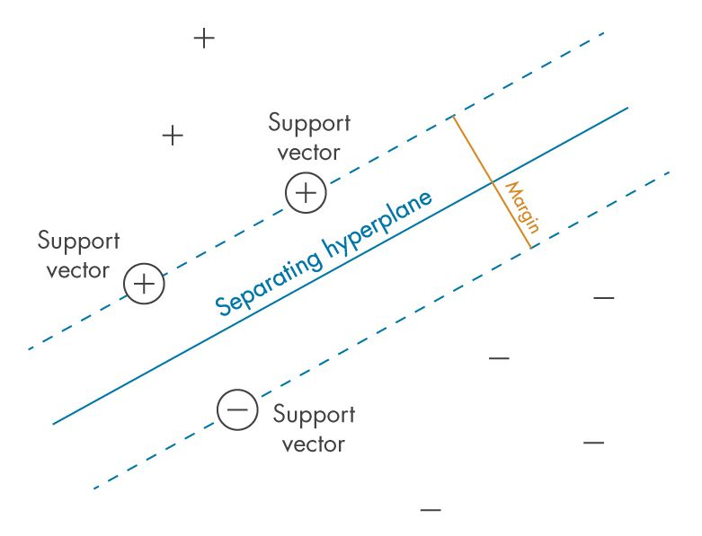
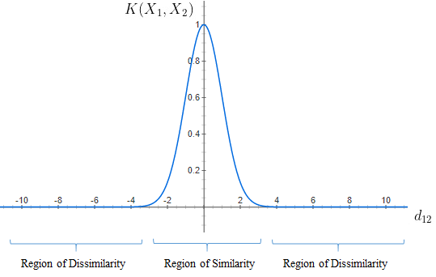
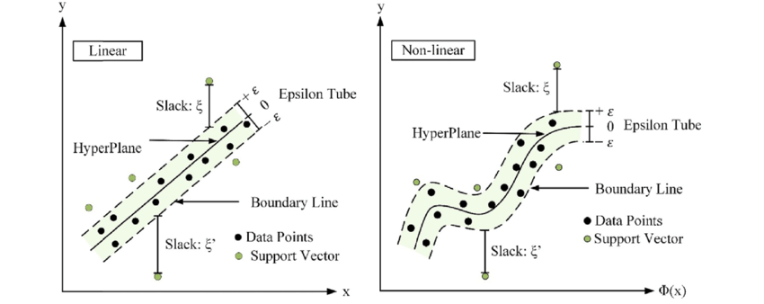

<!-- paginate: skip -->

<h1 class="section-header">Лекція 9</h1>

## SVM, SVR, Байєсівські класифікатори.

---

# Вcтуп

<!-- paginate: true -->

Розглянуті далі методи машинного навчання залишаються серед найефективніших у задачах з обмеженою кількістю даних, високою розмірністю або потребою у строгій математичній інтерпретації.
- **Методи опорних векторів (Support Vector Machines, SVM)**: строгі геометричні алгоритми, що максимізують margin розділення між класами.
- **Регресію опорних векторів (SVR)**: варіант SVM для прогнозування числових значень.
- **Байєсівські класифікатори**: сімейство моделей, заснованих на теорії ймовірностей і формулі Байєса.

---

# Support Vector Machine (SVM)

Нехай, наявний набір двовимірних точок двох класів.
- Ми хочемо провести лінію, яка їх розділить. Але таких ліній може бути нескінченно багато.
- Питання полягає в тому яку з них вибрати вибрати?

SVM дозволяє обрати лінію (гіперплощину), що має найбільшу відстань до найближчих точок обох класів. Саме ця відстань називається margin.

---

# Геометрична інтерпретація margin

Якщо гіперплощина визначається рівнянням:
$$
w^T x + b = 0,
$$
то відстань від точки до поверхні:
$$
\frac{|w^T x + b|}{|w|}.
$$
SVM дозволяє максимізувати:
$$
\text{Margin} = \frac{2}{|w|}.
$$
Відповідно, чим більший margin тим стійкіша модель.

---

# Геометрична інтерпретація margin

Це означає:
- модель менш чутлива до шуму у даних;
- невеликі зміни у навчальній вибірці не змінюють рішення;
- рішення узагальнюється краще.

Таким чином, SVM — це алгоритм, який адаптується до прикладів класів "на межі".

---

---

# Постановка задачі

Задача полягає в пошуку таких $w, b$, щоб усі точки були правильно класифіковані:
$$
y_i (w^T x_i + b) \ge 1.
$$
Тоді оптимізаційна задача:
$$
\min_{w} \frac{1}{2}|w|^2.
$$
Це називається квадратичною оптимізацією.

---

# Робота з реальними даними 

Оскільки реальні дані майже ніколи не є безпомилковими, то часто вводять так звані *пом’якшення (slack variables)*:
$$
y_i(w^T x_i + b) \ge 1 - \xi_i,\quad \xi_i \ge 0.
$$
І нова задача тоді має такий вигляд:
$$
\min_{w, \xi} \frac{1}{2}|w|^2 + C\sum_{i=1}^n \xi_i,
$$
* велике $C$ визначає високий штраф за помилки високе, а модель намагається класифікувати все точно, що веде до меншого margin, що несе ризик перенавчання;
* мале $C$ допускає більше помилок, що дає більший marging, і загалом краще узагальнення.

---

# Опорні вектори

Опорні вектори — це точки, які:
- лежать на межі або прилягають до неї,
- визначають положення розділювальної поверхні,
- мають $\xi_i > 0$ або $y_i(w^T x_i + b)=1$.

Загалом якщо видалити не опорні вектори, рішення SVM не зміниться, що вказує на унікальна властивість, якщо полягає в тому, що *модель залежить від малих, але “критичних” прикладів*.

---

# Якість роботи SVM

SVM використовує *геометричні та оптимізаційні принципи*, які вбудовано захищають модель від перенавчання.

1. **Максимальний margin** сам по собі є регуляризацією.
2. **Опорні вектори** допускають, що лише кілька точок контролюють рішення.
3. **Квадратична оптимізація** забезпечує єдиний глобальний мінімум.
4. **Вибір ядра** дозволяє створити складні нелінійні межі класифікації без збільшення розмірності.

---

# Двоїста форма SVM

<!-- https://uk.eitca.org/artificial-intelligence/eitc-ai-mlp-machine-learning-with-python/support-vector-machine/support-vector-machine-optimization/examination-review-support-vector-machine-optimization/what-is-the-objective-of-the-svm-optimization-problem-and-how-is-it-mathematically-formulated/ -->

Переходимо до оптимізації за коефіцієнтами $\alpha_i$:
$$
\max_{\alpha}
\sum_i \alpha_i -
\frac12 \sum_{i,j} \alpha_i \alpha_j y_i y_j (x_i^\top x_j)
$$
з урахуванням обмежень:
$$
\quad 0 \le \alpha_i \le C, \quad \sum_i \alpha_i y_i = 0.
$$
Тут, $\alpha_i$ є множниками Лагранжа, $C$ це параметр регулярізації, який контролює компроміс між максимізацією margin та мінімізацією помилки класифікації, а $x_i^\top x_j$ - лінійне ядро. Яке можна позначити так:
$$
x_i^\top x_j \longrightarrow K(x_i, x_j).
$$

---

# Ядрові методи SVM

Розглянемо задачу, де класи формують кільця:
- внутрішнє коло — клас 1,
- зовнішнє — клас 0.

У двовимірному просторі вони не є лінійно роздільними.
Але якщо додати ознаку:
$$
z = x_1^2 + x_2^2,
$$
то дані стануть лінійно віддільними в тримірному просторі.
Проблема полягає в тому, що неможливо передбачити, який саме простір потрібен.
Саме ядра дозволяють SVM працювати так, ніби трансформація вже відбулася.

---

# RBF-ядро
$$
K(x_i, x_j) = \exp(-\gamma |x_i - x_j|^2)
$$
- якщо дві точки близькі, то ядро $\approx 1$;
- якщо далекі → ядро $\approx 0$.

$\gamma$ регулює радіус впливу, де
- мале значення параметра $\gamma$ означає гладку межу розділення, а
- велике $\gamma$ - складну межа з можливим перенавчання.

Наприклад, у задачах класифікації рукописних цифр, розпізнаванні аномалій, де точки одного класу утворюють кілька локальних кластерів.
У таких ситуаціях RBF автоматично створює нескінченновимірне відображення, що дозволяє моделі будувати гнучкі, вигнуті межі навколо кожних локальних груп, ефективно обгортаючи дані незалежно від їх форми.

---

---

#  Поліноміальне ядро

$$
K(x_i, x_j) = (x_i^T x_j + c)^d.
$$
Додає взаємодії ознак $x_1 x_2, x_1^2, x_2^3,,\dots$, що корисно, якщо ознаки мають природні поліноміальні залежності.

Наприклад, у фізичних задачах траєкторія польоту м’яча залежить від $v^2$ і $\sin 2\theta$, економіці ефект масштабу, де прибуток зростає як $X + X^2$
У таких випадках SVM з поліноміальним ядром автоматично додає комбінації ознак $x_1^2, x_1 x_2, x_2^2,\dots$, створюючи межу рішення, яке відповідає реальній нелінійній структурі даних.

---

# Приклади для SVM

### Класифікація рукописних цифр (MNIST)
- Вихідні ознаки — 784 пікселі.
- Дані розріджені, нелінійні.
- SVM з RBF ядром відомо одна з найточніших класичних моделей.

### Визначення шархайства
- Дисбаланс класів.
- SVM із "м’яким" margin + stratified sampling.
- Гранична площина добре відокремлює аномалії.

---

# Support Vector Regression (SVR)

SVR (Support Vector Regression) — це варіант SVM, призначений для розв’язання задач регресії, тобто для прогнозування неперервних значень.

**Ідея $\varepsilon$-трубки**
У класичній регресії штрафуються всі помилки. У SVR натомість:
- помилки *менші за ε* не вважаються помилками,
- лише точки “поза трубкою” впливають на модель.

Точки всередині трубки — не опорні вектори.

---

---

# Формулювання задачі SVR

Нехай ми маємо
$$
\min_{w, b, \xi, \xi^*} \frac{1}{2}\lVert w \rVert^2 + C\sum (\xi_i + \xi_i^*)
$$
з обмеженнями:
$$
y_i - w^T x_i - b \le \varepsilon + \xi_i,
$$
$$
w^T x_i + b - y_i \le \varepsilon + \xi_i^*,
$$
$$
\xi_i,\xi_i^* \ge 0.
$$

- Для великих $\varepsilon$ модель ігнорує дрібні коливання, тому ми маємо гладкий тренд.
- Для великих $C$ ми маємо штраф за помилки поза трубкою модель намагається точно проходити через точки.

---

# Двоїста форма SVR

Вводимо множники Лагранжа: $\alpha_i, \alpha_i^* \ge 0$ для обмежень $\xi_i, \xi_i^*$.
Двоїста задача виглядає так:
$$
\begin{aligned}
\max_{\alpha_i, \alpha_i^*} \ & -\frac{1}{2} \sum_{i=1}^n \sum_{j=1}^n (\alpha_i - \alpha_i^*)(\alpha_j - \alpha_j^*) (x_i^\top x_j) \\
& - \varepsilon \sum_{i=1}^n (\alpha_i + \alpha_i^*) + \sum_{i=1}^n y_i (\alpha_i - \alpha_i^*) \\
& \sum_{i=1}^n (\alpha_i - \alpha_i^*) = 0, \\
& 0 \le \alpha_i, \alpha_i^* \le C.
\end{aligned}
$$

---

# Двоїста форма SVR

Після знаходження оптимальних $\alpha_i, \alpha_i^*$, функція прогнозується як:
$$
f(x) = \sum_{i=1}^n (\alpha_i - \alpha_i^*) (x_i^\top x) + b.
$$
Для нелінійної регресії, замість $x_i^\top x_j$ підставляємо ядро $K(x_i, x_j)$:
$$
x_i^\top x_j \longrightarrow K(x_i, x_j)
$$
Наприклад, для RBF-ядра:
$$
K(x_i, x_j) = \exp(-\gamma |x_i - x_j|^2)
$$
Тепер прогноз виглядає так:
$$
f(x) = \sum_{i=1}^n (\alpha_i - \alpha_i^*) K(x_i, x) + b
$$

---

# Баєсівські класифікатори

Формула Байєса
$$
P(y|x) = \frac{P(x|y)P(y)}{P(x)},
$$
- $P(y)$ — апріорна ймовірність класу, тобто наскільки часто клас $y$ зустрічається в даних до того, як ми побачили ознаки $x$.
- $P(x|y)$ — правдоподібність, ймовірність спостереження ознак $x$, якщо клас $y$ відомий.
* $P(y|x)$ — апостеріорна ймовірність, ймовірність класу  $y$ після того, як ми побачили ознаки $x$
- $P(x)$ - нормалізуюча константа, ймовірність спостереження ознак $x$ незалежно від класу.

---

# Наївний Баєс (Naive Bayes)

Мета класифікації: обрати клас, що максимізує апостеріорну ймовірність:
$$
\hat{y} = \arg\max_y P(y|x).
$$

Ми починаємо з наших очікувань щодо ймовірності класів $P(y)$ і коригуємо їх на основі того, що спостерігали $P(x|y)$.
Основне припущення полягає в тому, що ознаки незалежні всередині одного класу.
$$
P(x|y)=\prod_{i=1}^d P(x_i|y).
$$
Це радикально спрощує модель, але працює напрочуд добре.

---

# Наївний Баєс

### Переваги
- Швидка тренування та прогнозування.
- Працює добре навіть якщо ознаки насправді *частково залежні*.
- Потрібно дуже мало даних для оцінки параметрів.

### Недоліки
- Якщо ознаки сильно корельовані, точність може знижуватися.
- Для безперервних ознак потрібно робити додаткові припущення (наприклад, Gaussian Naive Bayes).

---

# Вибір моделі для прогнозу

Для кожного класу $y$ обчислюємо апостеріорну ймовірність:
$$
P(y|x) \propto P(y) \prod_{i=1}^d P(x_i|y)
$$
і обираємо клас з максимальною ймовірністю:
$$
\hat{y} = \arg\max_y P(y) \prod_{i=1}^d P(x_i|y).
$$

Знак пропорційності $\propto$ використовується, бо $P(x)$ однакове для всіх класів і не впливає на $\arg\max$.

---

# Приклад

Уявимо, що ми класифікуємо пошту як *спам/не спам*:
- $x_i$ — наявність певного слова в листі.
- $P(x_i | \text{спам})$ — ймовірність, що слово з’являється у спамі.
- $P(\text{спам})$ — частка спаму серед всіх листів.

Наївний Байєс поєднує ці ймовірності і дає прогноз: 
«спам», якщо апостеріорна ймовірність для спаму більше, ніж для не спаму.

---

# Гаусівський НБ (Gaussian NB)

Використовується для *безперервних ознак* (дійсні числа).
Основне припущення полягає в тому, що значення ознаки для кожного класу розподілені нормально (гаусовий розподіл).

Для ознаки $x_i$ класу $y$ ймовірність:
$$
P(x_i | y) = \frac{1}{\sqrt{2 \pi \sigma_{y,i}^2}} \exp\Big(-\frac{(x_i - \mu_{y,i})^2}{2\sigma_{y,i}^2}\Big),
$$
де $\mu_{y,i}$ та $\sigma_{y,i}^2$ оцінюються з навчальних даних.
Як приклад можна навести прогнозування ризику захворювань за віком, тиском, рівнем холестерину, кожну ознака ту числова, і їх розподіл наближено нормальний.

---

# Мультиноміальний NB (Multinomial NB)

Використовується для *дискретних, частотних даних*, як-от кількість слів у тексті і, відповідно, часто застосовується у класифікації текстів.

Для документа $x = (x_1, x_2, \dots, x_d)$ (кількість появ слів):
$$
P(x | y) = \frac{(\sum_i x_i)!}{\prod_i x_i!} \prod_{i=1}^d P(x_i | y)^{x_i}.
$$

$P(x_i | y)$ — ймовірність слова $i$ у класі $y$. Тут оцінюється як частка цього слова в документах класу $y$.

Знову розглянемо фільтрування спаму. Враховуємо, скільки разів слова «виграш», «безкоштовно» зустрічаються в листі.Також прикладом може бути класифікація новин за темами.

---

# Бернуллі НБ (Bernoulli NB)

Використовується для *бінарних ознак* (0/1, слово є/немає). Враховує тільки наявність/відсутність ознаки, а не кількість.

Нехай $x = (x_1, x_2, \dots, x_d)$, тоді апостеріорна ймовірність:
$$
P(x | y) = \prod_{i=1}^d P(x_i | y)^{x_i} (1 - P(x_i | y))^{1-x_i}.
$$

Наприклад при прогнозуванні наявності певного захворювання $y \in \{\text{хворий}, \text{здоровий}\}$ за результатами простих аналізів маємо бінарні ознаки, які вказуватимути на наявність чи відсутність симптому.
Можель оцінює ймовірність появи кожного симптому для класу «хворий» та «здоровий». Потім обчислюється апостеріорну ймовірність класу, а клас з більшою ймовірністю обирається як прогноз.
